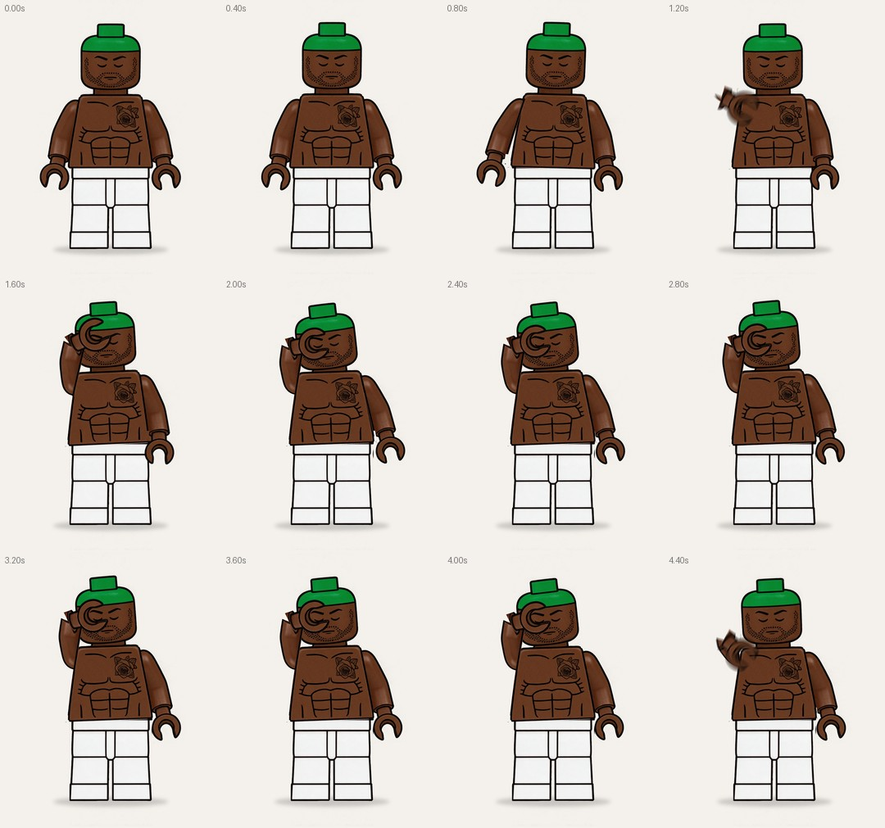

# LEGO-персонаж · «рука к лицу» · 5 секунд, луп

Персонаж из иллюстрации разрезан на 7 слоёв и собран в After Effects на риг с иерархией суставов. Он стоит и дышит, берёт замах, поднимает руку через грудь и закрывает ладонью лицо, чуть опуская голову, — как на референсе. Затем держит позу и возвращается в стартовое положение ровно к 5-й секунде, поэтому ролик крутится без шва.



Превью: [`preview/lego_facepalm_preview.mp4`](preview/lego_facepalm_preview.mp4) (1080×1350, 30 fps, 5 с).

## Как собрать в After Effects

1. Откройте After Effects (CC 2018 или новее).
2. `File → Scripts → Run Script File…` → `build_lego_motion.jsx`. Папка `assets/` должна лежать рядом со скриптом.
3. Откроется композиция `LEGO_FACEPALM`.

## Тайминг

| Время | Движение |
|---|---|
| 0.00–0.55 | стоит и дышит |
| 0.55–0.85 | замах: рука чуть уходит наружу, корпус наклоняется |
| 0.85–2.20 | рука поднимается вперёд-вверх, как у настоящей минифигурки (вращение в плече), кисть ложится на глаз с перелётом и досадкой, голова опускается |
| 2.20–4.15 | держит позу, дышит |
| 4.15–5.00 | рука возвращается вниз в стартовую позу, дальше луп |

## Слои и риг

Все PNG нарезаны на общем холсте 1122×1500, поэтому у каждого ребёнка Position равна точке сустава в пикселях картинки.

| Слой | Родитель | Точка вращения |
|---|---|---|
| `LEGS` | — | центр стоп; здесь масштаб и место в кадре |
| `TORSO` | LEGS | бёдра; дыхание — выражение на Scale |
| `HEAD` | TORSO | шея (шея продлена вниз под торс, щели при наклоне нет) |
| `ARM_L` | TORSO | плечо; эта рука идёт к лицу. Подъём вперёд — Scale Y (100 → 0: смотрит в камеру → −75: поднята выше плеча) + доворот Rotation 24° |
| `HAND_L` | TORSO | запястье; едет за концом руки выражением `parent.fromComp(ARM_L.toComp(...))`, поэтому масштаб руки не наследует и не искажается; при подъёме увеличивается до 112 % (ближе к камере) |
| `ARM_R` → `HAND_R` | TORSO | плечо → запястье; вторичное покачивание |
| `CONTROLS` | — | `Breath` (сила дыхания), `Shadow Opacity`, цвет фона |
| `FLOOR_SHADOW`, `BG` | — | тень под ногами и фон |

Рука LEGO жёсткая: в плоскости кадра она не выгибается, а только «поворачивается к камере» в плече, как настоящая деталь. Анимация — обычные ключи Rotation и Scale (у головы ещё Position) с плавным easing. Их удобно двигать в Graph Editor. На слое `CONTROLS` стоят маркеры фаз.

## Частые правки

- **Закончить на позе «рука на лице», без возврата:** удалите последние ключи у `ARM_L`, `HAND_L`, `HEAD`, `TORSO` (после 4.15 с) или обрежьте рабочую область на 4.1 с.
- **Точнее положение кисти на лице:** финальные значения — `ARM_L` Scale Y −75 %, Rotation 24°; `HAND_L` Rotation −114°, Scale 112 %.
- **Размер и место в кадре:** `charScale` и `feet` в блоке `CFG` скрипта или Scale/Position у слоя `LEGS`.
- **Формат кадра:** `width` и `height` в `CFG`.

## Инструменты

```bash
pip install numpy opencv-python-headless pillow imageio-ffmpeg
python3 tools/cut_layers.py character.webp assets        # нарезка иллюстрации на слои
python3 tools/render_preview.py --out preview.mp4 --sheet storyboard.jpg
npm i acorn && node ../nike_loop/tools/ae_mock_check.js build_lego_motion.jsx
```

`cut_layers.py` режет по чёрным контурам: боковые линии торса отслеживаются построчно, общая обводка остаётся у обеих соседних деталей, поэтому при движении швов нет. `render_preview.py` читает риг и ключи прямо из `.jsx`.

> Скрипт проверен на имитации API After Effects: настоящего AE в среде сборки нет. При первом запуске загляните в итоговое окно — если что-то пойдёт не так, там будет текст ошибки.
