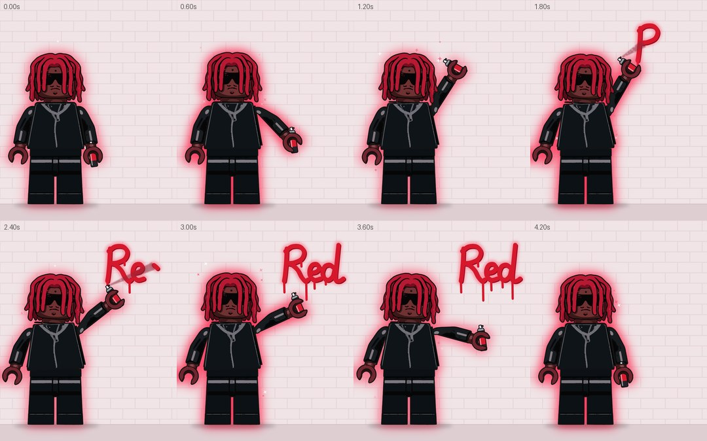
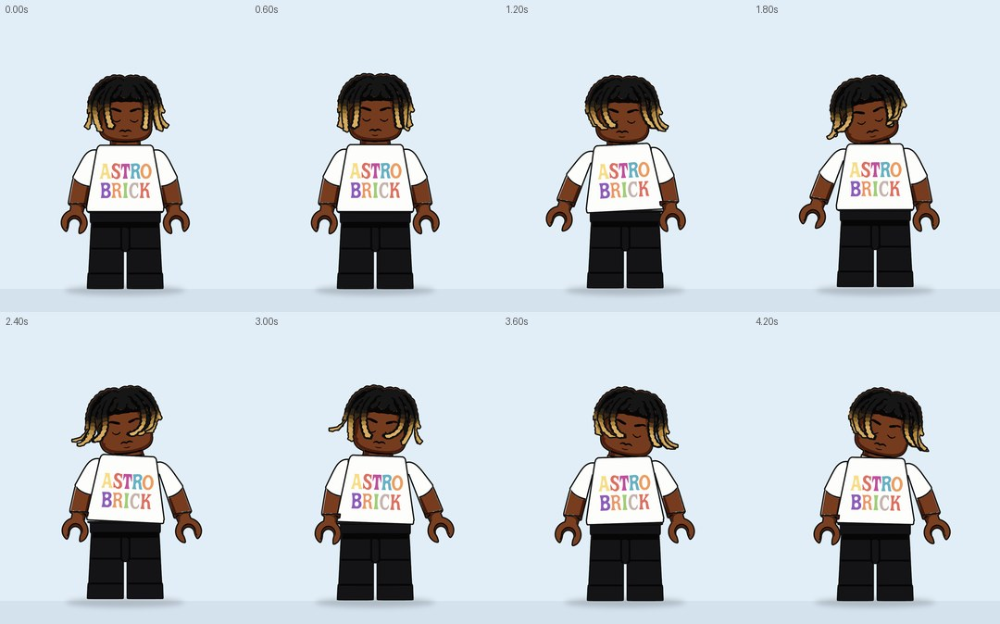
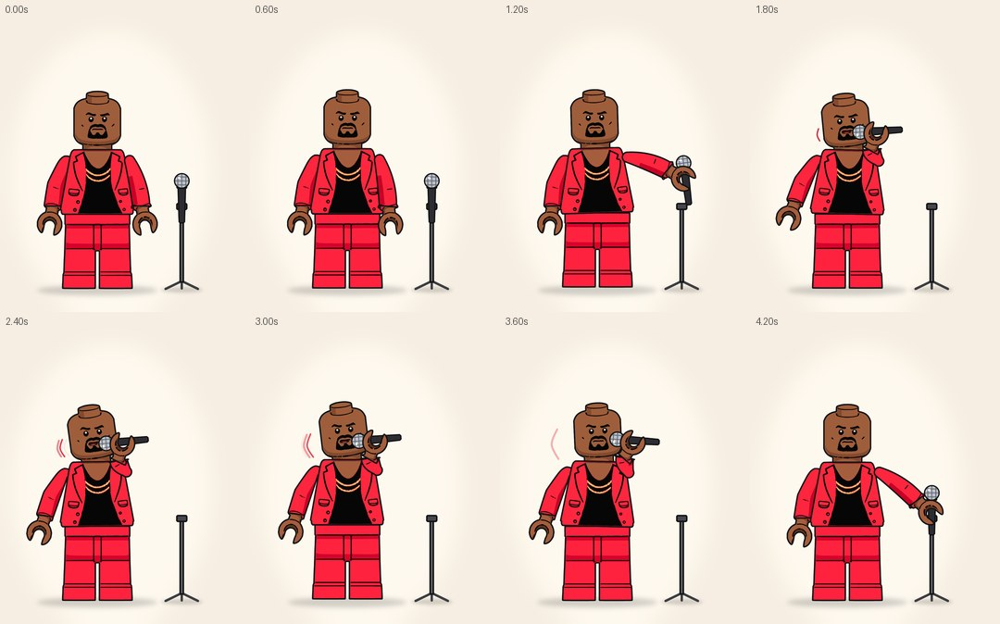
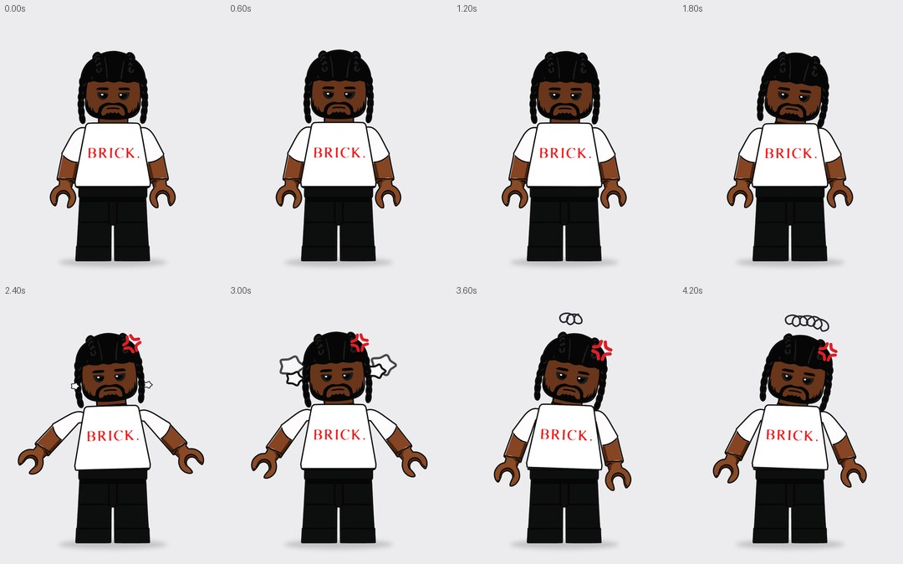
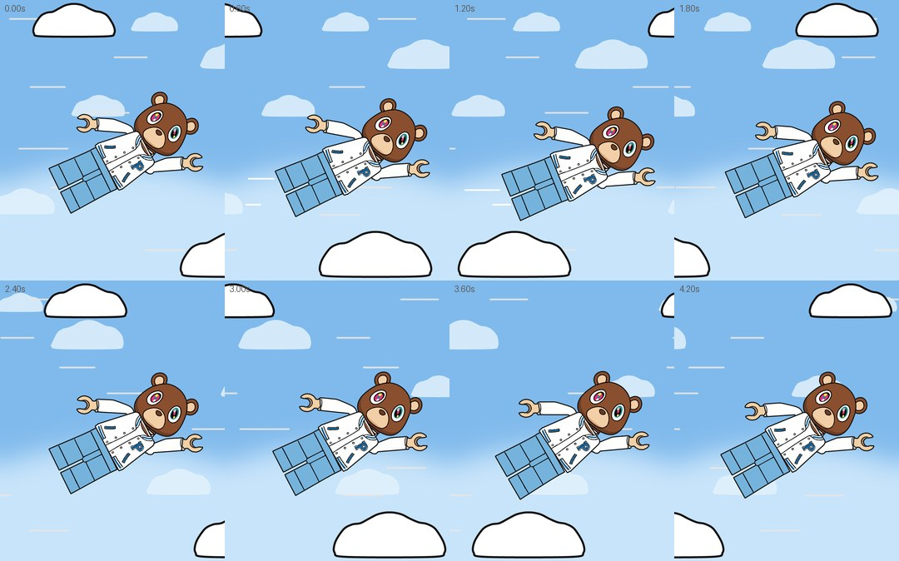

# LEGO SCENES · 5 сцен с реквизитом · 5 с, луп

Те же векторные минифигурки, что и в `lego_squad`: ровные заливки, одинаковая обводка 9 px, руки вращаются вокруг круглого плечевого шарнира, размытия в движении нет. В этих сценах у персонажей появился реквизит и эффекты. Все композиции 1080×1350, 30 fps, 5 с, луп без шва.

| Композиция | Что происходит | Превью |
|---|---|---|
| `LEGO_RED_DREADS_SPRAY` | Красная аура пульсирует вокруг силуэта, вверх летят искры, на очках блик. Он встряхивает баллончик и пишет на кирпичной стене «Red» в стиле граффити, как на референсе. Из сопла летит облачко краски, рука и баллончик следуют за точкой рисования, вниз бегут подтёки. Любуется, надпись тает, всё по кругу | [mp4](preview/red_dreads_spray.mp4) · [раскадровка](preview/red_dreads_spray_storyboard.jpg) |
| `LEGO_ASTRO_BRICK_HEADBANG` | Трясёт головой, дреды развеваются: каждая из 6 прядей — отдельный слой. Изгиб пряди посчитан физикой (маятник, который тянет голова: инерция, захлёст, затухание) | [mp4](preview/astro_brick_headbang.mp4) · [раскадровка](preview/astro_brick_headbang_storyboard.jpg) |
| `LEGO_RED_SUIT_MIC` | Берёт микрофон со стойки, подносит ко рту, как на референсе (рука поворачивается к камере), и говорит: рот открывается по слогам, расходятся звуковые дуги. Возвращает микрофон на стойку | [mp4](preview/red_suit_mic.mp4) · [раскадровка](preview/red_suit_mic_storyboard.jpg) |
| `LEGO_BRICK_BRAIDS_ANNOYED` | Недовольный: вздыхает, мотает головой «нет», раздражённо вскидывает руки, выскакивают жилка гнева и пар из ушей, отворачивается, над головой «туча» из каракулей, потом остывает | [mp4](preview/brick_braids_annoyed.mp4) · [раскадровка](preview/brick_braids_annoyed_storyboard.jpg) |
| `LEGO_VARSITY_BEAR_FLY` | Летит, как супергерой: одна рука вытянута вперёд, покачивается в потоке воздуха. Мимо проносятся облака (дальние медленнее, ближние быстрее), линии скорости, за ногами шлейф ветра | [mp4](preview/varsity_bear_fly.mp4) · [раскадровка](preview/varsity_bear_fly_storyboard.jpg) |







## Как собрать в After Effects

1. Нужен After Effects 2020 или новее: изгиб дредов сделан выражением на контурах.
2. Папка `scenes/` должна лежать рядом со скриптом. В ней по файлу на сцену: слои, контуры, ключи.
3. `File → Scripts → Run Script File…` → `build_lego_scenes.jsx`. В проекте появится папка `LEGO_SCENES` с пятью композициями.

Чтобы собрать одну сцену, впишите её имя в `var ONLY = "";`, например `"RED_SUIT_MIC"`.

## Слои

Персонаж собран так же, как в `lego_squad`: `LEGS` → `TORSO` → `HEAD` / `ARM_L` → `HAND_L` / `ARM_R` → `HAND_R`, внутри каждого слоя группы `Outline`, `Print N`, `Base`. Реквизит лежит отдельными шейп-слоями и привязан к нужной детали:

- **Спрей:** `SPRAY_CAN` (ребёнок `HAND_R`). Надпись — `RED_PAINT` (штрихи и подтёки на Trim Paths), `RED_SHADE` (тень) и `RED_GLOW` (свечение). Облако краски — `SPRAY_MIST`. Аура — слои `AURA_*` (дети деталей с размытием) и `SPARK_*`. Блик — `GLASSES_GLINT`.
- **Дреды:** `DREAD_1…6` — дети `HEAD`. Слайдер **Bend** на каждом слое задаёт изгиб пряди в градусах, его ключи посчитаны симуляцией. Под внутренними прядями лицо достроено.
- **Микрофон:** `MIC` (в руке, ребёнок `HAND_R`) и `MIC_ON_STAND` + `MIC_STAND`. Микрофоны подменяют друг друга hold-ключами Opacity в момент захвата. Правая рука `ARM_R` в этой сцене — рукав-трубка, построенный по форме оригинальной руки: когда рука поворачивается к камере, укорачивается только её ось, толщина и обводка остаются ровными (ключи контура). Кисть повёрнута по рукаву, запястье всегда входит в манжету. `MOUTH` и `SOUND_*` — рот и звуковые дуги.
- **Недовольство:** `ANGER_VEIN` (жилка), `STEAM_*` (пар), `GRUMBLE` (каракули на Trim Paths).
- **Полёт:** `CLOUD_FAR_*`, `CLOUD_NEAR_*`, `SPEED_*`, `WIND_*`, небо `BG` + `SKY_GLOW`.

Движения, которые зависят от других (рука следит за пером, баллончик целится в точку, микрофон смотрит в рот, изгиб дредов), записаны покадровыми линейными ключами. Остальное — обычные ключи с easing.

## Инструменты

```bash
pip install numpy opencv-python-headless pillow imageio-ffmpeg potracer scipy
python3 tools/split_dreads.py <папка_с_картинками>   # ASTRO_BRICK с отдельными прядями -> vectors/ASTRO_BRICK_DREADS.jsxinc
python3 tools/scenes.py                               # все сцены -> scenes/*.jsxinc
python3 tools/render.py all                           # превью mp4 + раскадровки
npm i acorn && node ../nike_loop/tools/ae_mock_check.js build_lego_scenes.jsx
```

`scenes.py` описывает сцены: ключи персонажа, реквизит, расчёт руки, баллончика, микрофона и физику прядей. Скрипт для AE и превью (`render.py` + `scenekit.py`) читают одни и те же данные, поэтому превью совпадает с композицией.

> Скрипт проверен на имитации API After Effects (5 композиций, 111 слоёв, ошибок нет): настоящего AE в среде сборки нет. Если при запуске что-то пойдёт не так, текст ошибки будет в итоговом окне.
