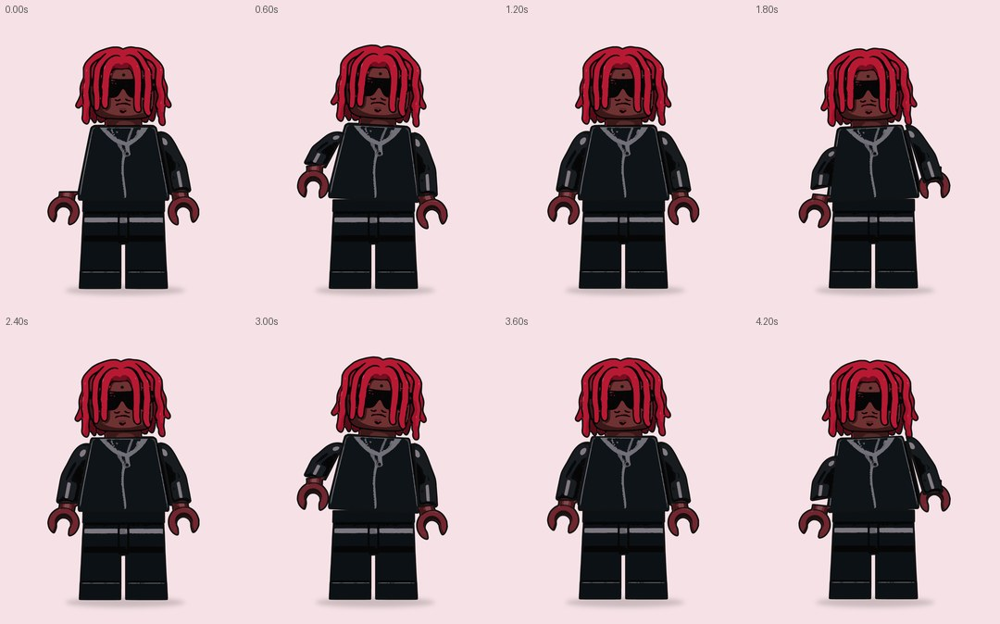
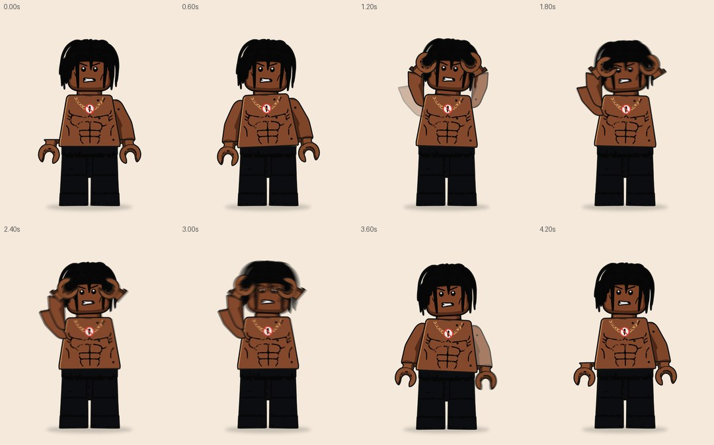
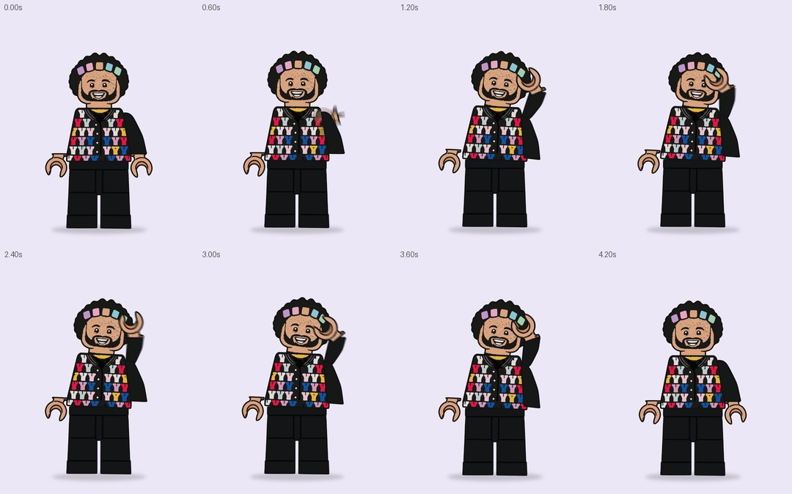
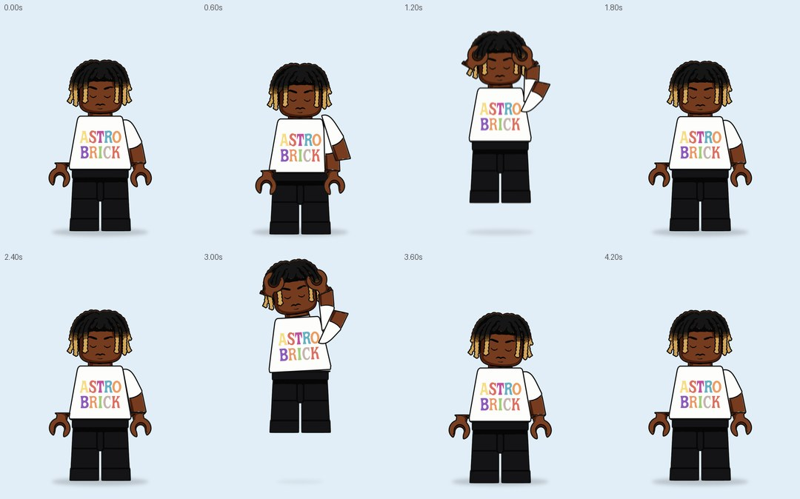
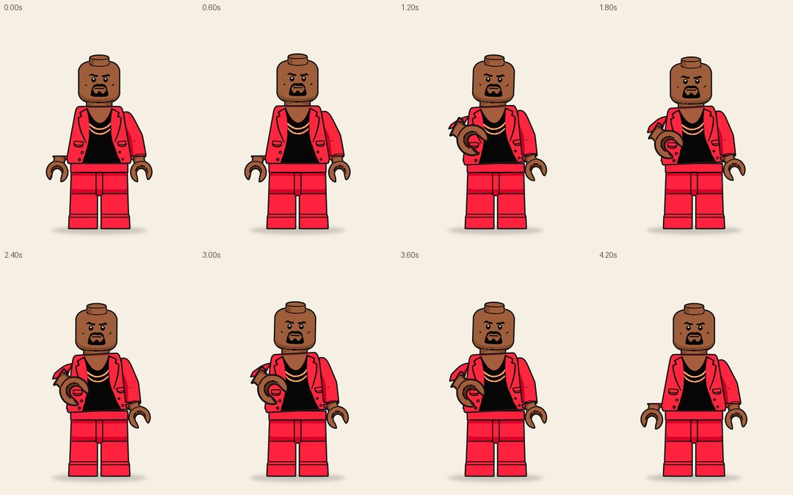

# LEGO SQUAD · 5 персонажей · 5 разных анимаций · 5 с, луп

Те же правила, что и в `lego_motion`: каждый персонаж целиком векторный, каждая деталь — шейп-слой After Effects с ровной заливкой и одинаковой обводкой 9 px. Края чёткие при любом масштабе, кривых срезов нет. Руки не гнутся и не перекручиваются: при подъёме вперёд контур руки укорачивается (как у минифигурки, повёрнутой в плече), а толщина обводки остаётся прежней.

Скрипт создаёт 5 композиций 1080×1350, 30 fps, 5 с. Каждая зациклена без шва: кадр 5.00 совпадает с кадром 0.00.

| Композиция | Анимация | Превью |
|---|---|---|
| `LEGO_RED_DREADS` | **groove**: качает головой в бит (96 BPM, 8 долей за 5 с), руки по очереди качаются, корпус пружинит | [mp4](preview/red_dreads.mp4) · [раскадровка](preview/red_dreads_storyboard.jpg) |
| `LEGO_ANGRY_CHAIN` | **rage**: напрягается, поднимает оба кулака, трясётся от злости, бьёт руками вниз и топает, тяжело дышит | [mp4](preview/angry_chain.mp4) · [раскадровка](preview/angry_chain_storyboard.jpg) |
| `LEGO_SMILE_VARSITY` | **wave**: поднимает руку к голове и машет, наклоняет голову, слегка подпрыгивает | [mp4](preview/smile_varsity.mp4) · [раскадровка](preview/smile_varsity_storyboard.jpg) |
| `LEGO_ASTRO_BRICK` | **jump**: присед, прыжок с руками вверх, приземление, затем второй, более высокий прыжок «йей»; тень на полу сжимается и бледнеет в воздухе | [mp4](preview/astro_brick.mp4) · [раскадровка](preview/astro_brick_storyboard.jpg) |
| `LEGO_RED_SUIT` | **point**: кивает, затем показывает пальцем прямо в камеру (рука укорачивается, кисть приближается) и качает рукой в такт | [mp4](preview/red_suit.mp4) · [раскадровка](preview/red_suit_storyboard.jpg) |







## Как собрать в After Effects

1. Нужен After Effects 2020 (17.0) или новее: укорачивание рук работает на выражениях `createPath`.
2. Папка `vectors/` должна лежать рядом со скриптом. В ней контуры деталей каждого персонажа.
3. `File → Scripts → Run Script File…` → `build_lego_squad.jsx`.
4. В проекте появится папка `LEGO_SQUAD` с пятью композициями. Откроется последняя.

Чтобы собрать одного персонажа, впишите его имя в `var ONLY = "";` в начале скрипта, например `"RED_SUIT"`.

## Слои (в каждой композиции)

Каждая деталь — отдельный шейп-слой. Внутри: группа `Outline` (обводка, сверху), группы `Print N` (принты: лицо, волосы, одежда, цепь и т. п.) и группа `Base` (заливка детали). Контуры лежат в координатах исходной картинки 1497×2000, поэтому Anchor Point каждой детали стоит в её суставе.

| Слой | Родитель | Что делает |
|---|---|---|
| `LEGS` | — | ноги; масштаб и место персонажа в кадре, прыжки — Position |
| `TORSO` | LEGS | корпус; дыхание — выражение на Scale |
| `HEAD` | TORSO | голова с волосами/причёской; повороты и кивки |
| `ARM_L`, `ARM_R` | TORSO | руки. Rotation — взмах в плече. Слайдер **Squash** — подъём вперёд: 100 = рука висит, 0 = смотрит в камеру, отрицательные значения — поднята выше плеча. Укорачивается контур, обводка не меняется |
| `HAND_L`, `HAND_R` | TORSO | кисти. Сами едут за концом руки (выражение на Position, учитывает Squash), вращаются и масштабируются отдельно |
| `CONTROLS` | — | `Background` (цвет фона), `Breath` (сила дыхания) |
| `FLOOR_SHADOW`, `BG` | — | тень под ногами (реагирует на прыжки) и фон |

Анимация — обычные ключи Rotation, Scale, Position и Squash с плавным easing. Их можно двигать в таймлайне как обычно.

## Частые правки

- **Размер и место в кадре:** `scale` у персонажа в массиве `SQUAD` и `feet` в `CFG`, или Scale/Position у `LEGS`.
- **Цвет фона:** `bg` в `SQUAD` или `CONTROLS → Background`.
- **Поменять анимации местами:** в `SQUAD` замените `anim` (доступны `groove`, `rage`, `wave`, `jump`, `point`). Позы рассчитаны на пропорции минифигурки, поэтому подходят любому персонажу.
- **Сделать спокойнее:** уменьшите `Breath` или удалите часть ключей у `HEAD`.

## Инструменты

```bash
pip install numpy opencv-python-headless pillow imageio-ffmpeg potracer
python3 tools/vectorize_squad.py <папка_с_картинками> vectors        # 10–14.webp -> vectors/*.jsxinc
python3 tools/anim_design.py                                           # ключи -> блок ANIMS в build_lego_squad.jsx
python3 tools/render_preview.py all --out-dir preview --mb 6           # превью mp4 + раскадровки
npm i acorn && node ../nike_loop/tools/ae_mock_check.js build_lego_squad.jsx
```

`vectorize_squad.py` режет персонажа на детали по швам минифигурки (плечи, пояс, манжеты), трассирует заливку детали до середины чёрного контура и цветные принты внутри неё; всё сглаживается кривыми Безье. `render_preview.py` строит превью из тех же контуров, рига и ключей, что и скрипт.

> Скрипт проверен на имитации API After Effects (5 композиций, 50 слоёв, 580 ключей, ошибок нет): настоящего AE в среде сборки нет. Если при запуске что-то пойдёт не так, текст ошибки будет в итоговом окне.
