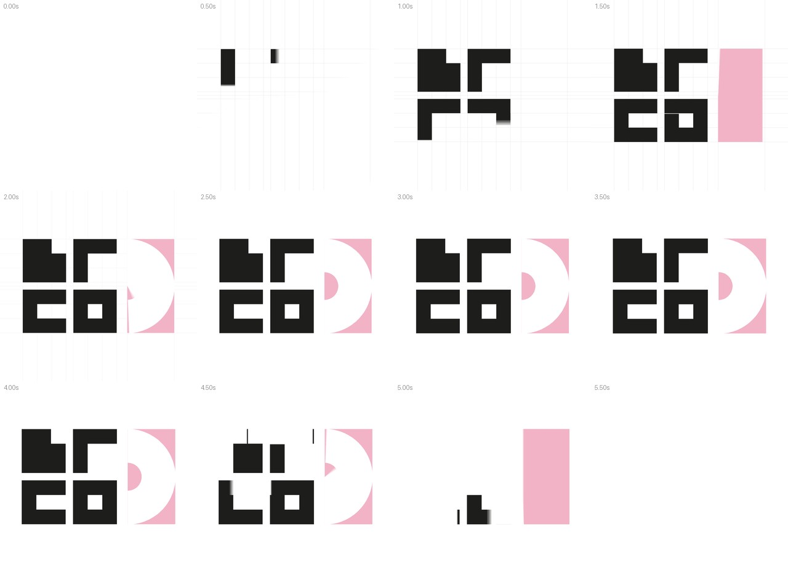

# Моушн логотипа · 1280×1240 · 6 секунд, луп

Минималистичная анимация логотипа для After Effects. Картинка как исходник не нужна: логотип заново собран вектором по его модульной сетке. Буквы 286×286 px из модулей по 95,3 px, зазор 48 px, розовая панель 310×620, полукруги R = 310 и R = 90. Цвета сняты с картинки: чёрный `#1D1D1B`, розовый `#F2B3C6`.



Превью: [`preview/logo_motion_preview.mp4`](preview/logo_motion_preview.mp4). Чистый вектор логотипа: [`logo.svg`](logo.svg).

## Как собрать в After Effects

1. Откройте After Effects (CC 2018 или новее).
2. `File → Scripts → Run Script File…` → `build_logo_motion.jsx`.
3. Откроется композиция `LOGO_MOTION`: 1280×1240, 30 fps, 6 с.

## Что происходит

| Время | Движение |
|---|---|
| 0.00–0.90 | Тонкая строительная сетка модулей прочерчивается по кадру |
| 0.30–1.55 | Буквы Ь, Г, С, О по очереди «рисуются» квадратной кистью, штрих за штрихом (О — по кругу) |
| 1.20–1.62 | Розовая панель выезжает слева направо |
| 1.45–2.10 | Белое «D» открывается поворотом по часовой, сверху вниз |
| 1.90–2.35 | Малый розовый полукруг открывается против часовой, снизу вверх |
| 1.80–2.40 | Сетка растворяется |
| 2.35–4.10 | Логотип целиком. Весь ролик идёт медленный наезд 97 → 100 % |
| 4.10–5.40 | Уход: каждый элемент исчезает, продолжая своё же движение (штрихи стираются по ходу, полукруги докручиваются, панель уезжает вправо) |
| 5.40–6.00 | Чистый кадр, и ролик начинается заново без шва |

## Слои

| Слой | Что это |
|---|---|
| `CONTROLS` | цвета: Black, Pink, Background, Grid (Effect Controls) |
| `LOGO` | null-родитель всех частей логотипа, в нём ключи наезда |
| `SMALL_DISC` | малый розовый полукруг: Trim Paths у толстой обводки |
| `D_CUTOUT` | белое «D» тем же способом, цвет = цвет фона |
| `PINK_PANEL` | розовая панель |
| `GLYPH_4_О`, `GLYPH_3_С`, `GLYPH_2_Г`, `GLYPH_1_Ь` | буквы; внутри группы `Bar 1…4` — отдельные штрихи с ключами Size/Position |
| `GRID` | строительная сетка (можно выключить глазком) |
| `BG` | фон |

У штрихов одной буквы общая заливка, поэтому на стыках нет швов. Все движения — обычные ключи с плавным easing, их можно двигать и менять в Graph Editor.

## Частые правки

- **Цвета** — слой `CONTROLS`. Фон и белое «D» меняются вместе.
- **Закончить на логотипе, без ухода** — в начале скрипта `outro: false`, затем пересобрать. Или просто обрежьте рабочую область на ~4 с.
- **Без сетки** — `grid: false` или выключить слой `GRID`.
- **Темп** — блок `T` в начале скрипта: задержка между буквами, длительности штрихов, время ухода. Поменяйте числа и пересоберите.
- **Другое разрешение или fps** — `width`, `height`, `fps` в `CFG`. Логотип всегда встаёт по центру.

## Экспорт

`Composition → Add to Render Queue` (или Adobe Media Encoder): H.264, 1280×1240, 30 fps, 0–6 с. Кадры 0 и 179 оба чисто белые, поэтому на повторе шва нет.

## Инструменты

```bash
pip install numpy opencv-python-headless pillow imageio-ffmpeg
python3 tools/render_preview.py --out preview.mp4 --sheet storyboard.jpg --svg logo.svg
npm i acorn && node ../nike_loop/tools/ae_mock_check.js build_logo_motion.jsx
```

`render_preview.py` берёт тайминги, геометрию и easing прямо из `.jsx`, поэтому превью совпадает с проектом. `ae_mock_check.js` прогоняет скрипт на строгой имитации API After Effects: синтаксис, match names, размерности значений, easing, выражения.

> Скрипт проверен на имитации API After Effects: настоящего AE в среде сборки нет. При первом запуске загляните в итоговое окно — если что-то пойдёт не так, там будет текст ошибки.
