# Стиль монтажа: гайд для каждого ролика

*Для YOUNG YANNY · 27.09.2026 · вертикальные Shorts/Reels/TikTok · версия 1.1*

Этот файл описывает стиль монтажа, чтобы каждый ролик выглядел одинаково, кто бы его ни монтировал: ты, монтажёр или ИИ-помощник. Здесь есть точные цифры: цвета, кадры, кривые, размеры, уровни звука. И готовые рецепты для After Effects.

> **Что нового в версии 1.1**
> - Субтитры **только красные** (Russo One). Белый пиксельный стиль и золотой стиль убраны.
> - Новый раздел про черновой монтаж: **паузы вырезаем все**, повторы и лишние фразы вырезаем по смыслу.
> - Цветокор без шума и текстур: **как в исходнике, чуть контрастнее и ярко**.
> - Когда показываем скрин, ссылку или интерфейс, **фон никогда не чёрный**. Добавлены 3 готовых фона и пример «было → стало».
> - **Вставок стало больше:** правило частоты и 16 шаблонов вставок с раскадровками из референсов.
> - **SFX разнообразнее:** библиотека звуков по событиям, уровень всегда **−12…−14 dB**.

**Как пользоваться:**
- Нужен быстрый ориентир — читай [раздел 0](#0-стиль-в-14-правилах) и [чек-лист](#18-чек-лист-перед-экспортом).
- Режешь черновик — [раздел 3](#3-черновой-монтаж-без-пауз-и-без-лишних-фраз).
- Делаешь субтитры — [раздел 5](#5-субтитры--всегда-и-только-красные) и [раздел 6](#6-apple-анимация-текста--главный-приём).
- Собираешь вставку — [разделы 7](#7-фоны-когда-что-то-показываем-никогда-не-чёрный) и [8](#8-вставки-моушн-графики).
- Ставишь звуки — [раздел 15](#15-звук-и-sfx).
- Отдаёшь задачу ИИ или монтажёру — дай ему [раздел 19](#19-спецификация-для-ии-и-монтажёра-yaml).

> ⚠️ Речь в видео-референсах я не транскрибировал: сервер с моделями распознавания речи заблокирован в моей среде. Тексты на экране прочитаны по кадрам, звук разобран по спектрограмме и громкости.

---

## 0. Стиль в 14 правилах

1. **Субтитры есть всегда, и они всегда красные.** Каждое слово спикера на экране, шрифт Russo One, коралово-красный с фаской и тенью. Белых субтитров нет.
2. **Пауз нет.** Между фразами ноль тишины, в ролике остаётся только речь.
3. **Лишнее вырезано по смыслу.** Дубли, повторы мысли, оговорки и «воду» убираем. Ролик читается как связный текст.
4. **Текст появляется в стиле Apple.** Слово выплывает из размытия: прозрачность 0 → 100 %, размытие 20 → 0 px, подъём на 30–40 px. Около 9 кадров, быстрый старт и долгое мягкое торможение. Без отскоков и пружин.
5. **Слово появляется ровно тогда, когда его произносят**, за 1–2 кадра до звука, но не позже.
6. **Вставок много.** Моушн-вставка каждые 3–6 секунд, это 50–60 % ролика. Спикер без вставки подряд не дольше 4–5 секунд.
7. **Когда что-то показываем, фон никогда не чёрный.** Скрин, ссылка, профиль или интерфейс стоят в карточке с тенью на светлом дизайнерском фоне: студийная сетка, стол сверху, светло-серый с лентой.
8. **Один главный объект в центре кадра** с мягкой длинной тенью. Вокруг пусто и спокойно.
9. **Цвет как в исходнике, только чуть контрастнее.** Картинка яркая. Никакого шума, зерна, растра и виньетки на видео.
10. **У кадра есть глубина:** размытые тёмные «лопасти» по углам вставок, тени у объектов, параллакс.
11. **Кадр никогда не стоит.** Камера медленно наезжает или дрейфует, и каждые 0,3–1 с появляется что-то новое.
12. **Переходы через движение:** расфокус, рывок с моушн-блюром, пролёт объекта, склейка по форме. Стандартных растворений и шторок нет.
13. **SFX на каждое событие, разные и всегда на −12…−14 dB.** Один и тот же звук два раза подряд не ставим.
14. **Концовка:** бесшовная петля или короткая фирменная заставка на 1–2 с.

---

## 1. Исходники, по которым сделан гайд

| # | Файл | Что это | Что берём |
|---|---|---|---|
| A | `0e94903b…mp4` (40,2 с, 30 fps) | История бренда Supreme, в конце заставка студии **Vane Motion** | Светлая редакционная эстетика, пара «курсив + жирный гротеск», проявление по словам и по буквам, мокап телефона, портреты в рамках, 3D на постаменте |
| B | `5db27bf5…mp4` (23,1 с, 30 fps) | «No magic pill». 11,5 с, повторено дважды: это **петля** | Студийный белый фон с сеткой из точек, «лопасти» с цветной каймой, курсор и рамка выделения, пролёт объекта |
| C | `d67f7872…mp4` (10,1 с, 16 fps) | Баффет, деньги, Греция | Стол сверху с предметами, экран в рамке, наклейки-счётчики, стопка слов в рамке из предметов |
| D | `e27e70c9…mp4` (14,1 с, 30 fps) | Футболист, мозг | Разрез фото, склейка по форме, луч света, отъезд камеры |
| S1 | `subtitles/red-russo-01.png`, `-02.webp`, `-03-fullframe.webp` | Твои субтитры: «С СЕГОДНЯШНЕГО ДНЯ», «ССЫЛКА В ОПИСАНИИ», «В TELEGRAM-КАНАЛЕ» | **Единственный стиль субтитров** и их точная позиция в кадре |
| BG | `backgrounds/ref-desk-flatlay.webp`, `ref-studio-dotgrid.png` | Кадры-образцы фонов (скрины 3 и 4) | Какими должны быть фоны, когда что-то показываем |
| F | `fonts/RussoOne-Regular.ttf` | Russo One, кириллица есть, лицензия OFL | Главный шрифт |

Все файлы для работы лежат в `assets/`:

```
assets/
├── fonts/RussoOne-Regular.ttf
└── montage/
    ├── subtitles/    ← образцы красных субтитров
    ├── backgrounds/  ← готовые фоны 1080×1920, «лопасть» для углов, образцы и пример «было → стало»
    ├── inserts/      ← раскадровки шаблонов вставок из референсов
    ├── refs/         ← раскадровки анимаций текста и переходов
    └── scripts/srt-to-markers.jsx  ← SRT → маркеры в After Effects
```

---

## 2. Формат, безопасные зоны, экспорт

### Проект
| Параметр | Значение |
|---|---|
| Разрешение | **1080×1920** (9:16) |
| Частота кадров | **30 fps**. Все кадры в этом гайде указаны для 30 fps |
| Цветовое пространство | Rec.709 |
| Моушн-блюр | Включён на всём, что движется. Shutter Angle 180°, Phase −90° |

### Безопасные зоны (под интерфейс Shorts, Reels и TikTok)
```
┌──────────────── 1080 ────────────────┐
│  0–200 px: ник, «Подписаться»         │
│  заголовки вставок: центр y ≈ 250–320  │
│                                       │
│    ЗОНА ОБЪЕКТОВ И КАРТОЧЕК           │
│    x: 70–950 px, y: 200–1480 px       │
│                          справа       │
│                          950–1080:    │
│                          кнопки       │
│  СУБТИТРЫ: центр строки y ≈ 1210      │
│                                       │
│  1480–1920: описание, музыка          │  ← текст сюда не ставим
└───────────────────────────────────────┘
```

### Экспорт
| Параметр | Значение |
|---|---|
| Контейнер и кодек | MP4, H.264 High |
| Битрейт | VBR, 2 прохода, **16 Мбит/с**, максимум 24 |
| Звук | AAC, 48 кГц, 320 кбит/с |
| Громкость | **−14 LUFS** интегральная, пик не выше **−1 dBTP** |
| Первые 5–10 кадров | Кадр-обложка: главный объект и крупное красное слово. Платформы часто берут этот кадр в превью |

---

## 3. Черновой монтаж: без пауз и без лишних фраз

Это первый шаг, до всей графики. Графика и субтитры ставятся уже на чистую речь.

### 3.1 Паузы: вырезаем все

| Что | Правило |
|---|---|
| **Паузы между фразами** | Вырезаем полностью. Следующее слово начинается сразу за предыдущим |
| **Паузы внутри фразы** (задумался посреди предложения) | Тоже вырезаем |
| **«Воздух» у склейки** | Оставляем 2–3 кадра до первого звука слова и после последнего, чтобы не съесть начало и конец |
| **Вдохи, причмокивания, «э-э», «м-м»** | Вырезаем |
| **Звук на склейке** | Кроссфейд 2 кадра (Constant Power), чтобы не было щелчков |
| **Скачок картинки на склейке** | Маскируем: чередуем крупность 100 % ↔ 112 % на соседних кусках, закрываем склейку вставкой или делаем переход в бит |
| **Проверка** | В ролике нет ни одного места, где спикер молчит дольше ~0,15 с |

**Чем резать:**
- **Premiere Pro:** текстовый монтаж (панель «Текст» → транскрипция). Найди паузы и удали их все разом, порог 0,2 с. Потом пройди вручную: клавиши **Q/W** (Ripple Trim) обрезают начало или конец куска по плейхеду и сдвигают всё остальное.
- **CapCut:** если в твоей версии есть автоудаление пауз, используй его, но потом проверь на слух. Если нет, режь по волновой форме.
- **auto-editor** (бесплатная утилита для командной строки): `auto-editor input.mp4 --margin 0.1sec`. Режет тишину и оставляет 0,1 с (3 кадра) воздуха. Результат открывается в Premiere для доводки.

### 3.2 Лишние и повторяющиеся фразы: режем по смыслу

| Что вырезаем | Как решаем |
|---|---|
| **Дубли** (сказал фразу 2–3 раза) | Оставляем одну лучшую попытку, обычно последнюю |
| **Повтор мысли** другими словами | Оставляем более короткую и сильную формулировку |
| **Оговорки и самоисправления** («как сделать, как сделать…») | Оставляем только чистую версию |
| **Служебная речь** («так, сейчас», «ещё раз», «короче», «ну вот», «на самом деле») | Вырезаем |
| **Уточнения без новой информации** | Вырезаем |
| **Фраза, после вырезания которой смысл не теряется** | Вырезаем |

**Чего не делаем:**
- Не вырезаем фразу, без которой следующая непонятна.
- Если после вырезания связка стала нелогичной, **переставь блоки** или верни короткий кусок.
- Не склеиваем слова из разных фраз в новое предложение, которого спикер не говорил.

**Проверка логики.** Прочитай итоговый транскрипт как текст. Он должен идти по схеме **хук → зачем это зрителю → шаги → результат → призыв к действию**. Каждая фраза добавляет что-то новое.

**Пример:**

> **Было:** «Короче, всем привет. Э-э… сегодня я вам покажу, как сделать, как сделать вот этот эффект. Вот этот эффект из клипа. Ну, короче, он несложный, на самом деле он несложный. Так, открываем After Effects…»
>
> **Стало:** «Всем привет. Сегодня покажу, как сделать этот эффект из клипа. Он несложный. Открываем After Effects…»

---

## 4. Цвет: как в исходнике, только чуть контрастнее

**Принцип:** картинка остаётся такой же, как ты снимаешь: естественная кожа, яркие цвета. Добавляем немного контраста, и всё. Яркость не опускаем.

### 4.1 Настройки

| Lumetri Color → Basic Correction (Premiere/AE) | Значение |
|---|---|
| Temperature / Tint | Как в исходнике (0) |
| Exposure | 0. Поднимай до +0,3, только если исходник тёмный |
| **Contrast** | **+10…+15** |
| Highlights | −5…−10 (чтобы не выбить светлые места) |
| Shadows | 0…+5 |
| Whites | +5…+10 |
| Blacks | −5…−10 |
| Saturation | 100–105 |
| Vibrance (вкладка Creative) | +5…+10 |
| Sharpen (вкладка Creative) | 0–10 |

**CapCut** (Настройка): контраст +8…+12, насыщенность +3…+5, светлые −5, яркость 0.

### 4.2 Запрещено
- ❌ Шум, зерно, «плёнка», растр или полутон поверх видео.
- ❌ Виньетка на спикере.
- ❌ Ч/б или приглушённый цвет спикера.
- ❌ «Киношные» LUT (teal & orange и похожие), которые тушат цвета.
- ❌ Пикселизация и Mosaic.

### 4.3 Проверка
- Включи и выключи Lumetri: разница должна быть **лёгкой**. Картинка чуть плотнее, но не другая.
- Кожа выглядит естественно, не оранжевая и не серая.
- В тёмных местах видны детали.
- Картинка не темнее исходника.

**На вставках** скрины, фото и видео тоже в цвете, как есть. Ч/б только если фото изначально чёрно-белое.

---

## 5. Субтитры — всегда и только красные

### 5.1 Правила текста

| Правило | Как делать |
|---|---|
| **Что пишем** | Каждое слово спикера после чистки из раздела 3. Мат либо запикиваем звуком и пишем `***`, либо не используем |
| **Сколько слов на экране** | **1–3 слова**, до 18 знаков в строке. Одна строка, максимум две |
| **Где резать фразу** | По смыслу. Предлог не отрываем от слова: «в описании», а не «в / описании» |
| **Сколько держим** | До начала следующей фразы. Пауз в ролике нет, поэтому субтитры идут без пропусков |
| **Цифры** | Цифрами: «10 000», «3 ошибки», «AE 2026» |
| **Названия программ и плагинов** | Как в оригинале, латиницей: After Effects, Deep Glow, TELEGRAM |
| **Пунктуация** | Точек нет. «!» и «?» ставим, если есть интонация |
| **Проверка** | Сверяем каждое слово на слух. Авторасшифровка ошибается в сленге, именах рэперов и названиях плагинов |

### 5.2 Стиль «Red Russo» — единственный стиль субтитров


| Параметр | Значение |
|---|---|
| Шрифт | **Russo One Regular** (`assets/fonts/RussoOne-Regular.ttf`) |
| Регистр | ВСЕ ЗАГЛАВНЫЕ |
| Кегль | **76–86 px**, по умолчанию **80 px**. На твоём кадре с ТГ около 76 px, на «С СЕГОДНЯШНЕГО ДНЯ» около 84 px |
| Ширина строки | Не больше **920 px**. «В TELEGRAM-КАНАЛЕ» у тебя занимает ровно 920 px (от 121 до 1041) |
| Трекинг | 0…+20 (в единицах AE) |
| Интерлиньяж, если 2 строки | 100–105 % кегля |
| Выключка | По центру |
| Заливка | Градиент сверху вниз **#FF8A7E → #EE5E52**, средний тон около **#F86F60** (замерено по твоим скриншотам) |
| Фаска (Bevel & Emboss) | Inner Bevel, Smooth, Size 3 px, Soften 1–2 px, Angle 90°, Altitude 30–40°. Свет: белый, Screen, 45 %. Тень: **#C34D4E**, Multiply, 55–60 % |
| Тень (Drop Shadow) | Чёрная, 65–75 %, Angle 90° (вниз), Distance 4–6 px, Size 10–14 px |
| Обводка | Нет |

**Собрать в AE:** выдели слой → Layer → Layer Styles → **Gradient Overlay**, **Bevel and Emboss**, **Drop Shadow** с параметрами из таблицы. Сохрани слой как пресет (Animation → Save Animation Preset), чтобы не собирать заново.

> ❌ Белых, золотых, пиксельных и любых других субтитров нет. Для речи только этот стиль.

### 5.3 Заголовки на вставках — тот же стиль, крупнее

Заголовок вроде «ТГ-КАНАЛ», «ШАГ 1», «ДО / ПОСЛЕ» набираем **тем же красным Russo One**:
- кегль **130–150 px**, центр по высоте y ≈ **250–320 px**;
- фаска Size 4–5 px, тень Distance 6–8 px, Size 16 px;
- появление по буквам (T1 в [разделе 9](#9-библиотека-анимаций-текста)).

### 5.4 Акцентное слово внутри фразы

Цвет остаётся красным. Выделяем размером и движением:
- слово крупнее на **15–20 %** (кегль 92–100 px);
- появляется по буквам с шагом 2 кадра (T1) или «встаёт» из размытия со 110 % (T3);
- на него ставим SFX (мягкий поп или удар).

Не больше **одного акцента на 3–5 секунд**, иначе акцентов не видно.

### 5.5 Позиция и размер

- Центр строки субтитров: **y ≈ 1210 px** (на твоём кадре с ТГ строка стоит на 1187–1239 px). Держим одну высоту на весь ролик.
- Если в этом месте лицо, карточка или важная деталь, **двигай графику, а не субтитры**. Карточки на вставках ставим выше, чтобы их низ был не ниже y ≈ 1140.
- Ниже y = 1440 субтитры не опускаем: там интерфейс платформы.

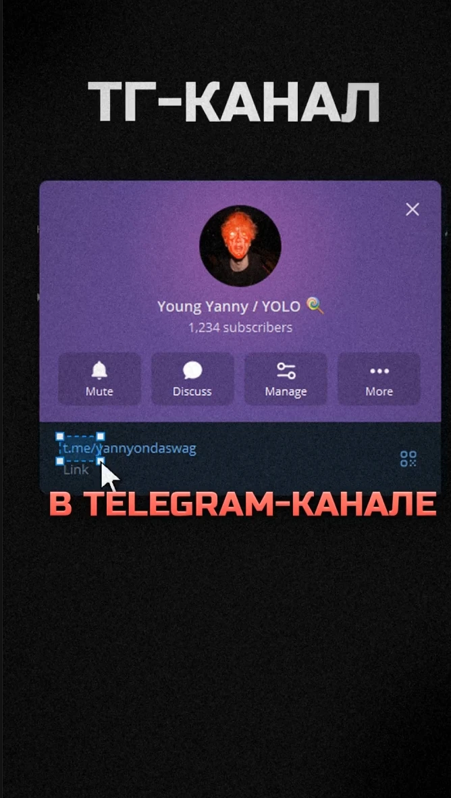

*Твой кадр: заголовок сверху, контент по центру, субтитры на y ≈ 1210. Позиция правильная, но **фон должен быть не чёрным**, см. [раздел 7](#7-фоны-когда-что-то-показываем-никогда-не-чёрный).*

### 5.6 Синхронизация с речью

| Правило | Значение |
|---|---|
| Когда появляется слово | За **1–2 кадра** до начала звука слова |
| Самое позднее | В момент звука. Опаздывать нельзя |
| Шаг между словами | По речи. В референсе A слова появляются через 0,07–0,13 с (2–4 кадра) |
| Смена фразы | На смене мысли или на склейке |
| Проверка | Смотри на скорости 0,5× со звуком: каждое слово «прыгает» на экран вместе с голосом |

**Как получить тайминги слов:**
- **Premiere Pro:** Текст → Транскрибировать → Создать субтитры. Максимум 18 знаков, минимальная длительность 0,3 с, промежуток 0 кадров, одна строка. Исправь ошибки → экспорт SRT.
- **CapCut:** Текст → Автосубтитры (русский) → исправить → экспорт SRT (если нужен AE).
- **Whisper локально** (точные тайминги по словам): `whisper voice.wav --model large-v3 --language ru --word_timestamps True --max_words_per_line 3 --output_format srt`.

---

## 6. Apple-анимация текста — главный приём

### 6.1 Принцип

Так текст появляется в презентациях Apple и на apple.com, и так же во всех референсах:

- текст **выплывает из размытия**, одновременно становится видимым и чуть поднимается;
- стартует быстро и **долго, мягко тормозит** (кривая ease-out);
- **никаких отскоков**, пружин и вращений (кроме отдельного приёма T2);
- элементы появляются **по очереди**: слова по речи, буквы с шагом 1,5–2 кадра;
- исчезает текст либо вместе со сценой, либо коротко и незаметно.


*Референс A, 0,40–1,20 с: «watch» и «how» выплывают по словам, «SUPREME» по буквам с шагом около 2 кадров. Буква появляется бледной и размытой, потом наливается цветом и становится резкой.*

### 6.2 Тайминги (30 fps)

| Параметр | **Слово** (субтитры) | **Буква** (заголовок, акцент) | **Крупное слово целиком** | **Исчезновение** |
|---|---|---|---|---|
| Длительность одного элемента | **9 кадров** (0,30 с), диапазон 7–12 | **7 кадров** (0,23 с) | **13 кадров** (0,43 с) | **4 кадра** (0,13 с) |
| Задержка между элементами | По речи; при фиксированной — 3 кадра (0,10 с) | **1,5–2 кадра** (0,05–0,066 с) | — | Все сразу |
| Прозрачность | 0 → 100 % | 0 → 100 % | 0 → 100 % за первые 60 % времени | 100 → 0 % |
| Размытие (Blur) | **20 → 0 px** (16–24) | 12 → 0 px | 28 → 0 px | 0 → 10 px |
| Сдвиг по Y | **+36 → 0 px** (≈ 0,45 кегля) | +24 → 0 px | 0 | 0 → −12 px |
| Масштаб | 100 % (можно 96 → 100 %) | 100 % | **110 → 100 %** | 100 % |
| Кривая | **ease-out** (ниже) | ease-out | ease-out | **ease-in** |

### 6.3 Кривые

| Кривая | cubic-bezier | Где |
|---|---|---|
| **Apple ease-out** (основная) | **(0.22, 1, 0.36, 1)**, это easeOutQuint | Всё, что появляется |
| Мягкая ease-out | (0.25, 0.1, 0.25, 1) | Долгие движения камеры и объектов |
| ease-in для исчезновения | (0.55, 0, 1, 0.45) | Исчезновение текста, уход объекта из кадра |
| ease-in-out | (0.65, 0, 0.35, 1) | Наезды и дрейф камеры |

**Настройка в Graph Editor (AE)** для ease-out на двух ключах:
- первый ключ: **Outgoing Influence 5–10 %**, скорость высокая (почти линейный старт);
- второй ключ: **Incoming Influence 85–95 %**, скорость 0.
- Контроль: на графике скорости резкий пик в начале и длинный пологий хвост до нуля.

### 6.4 Сборка аниматора в AE (субтитры по словам)

1. Текстовый слой в стиле из 5.2.
2. **Animate → Opacity.** Потом в этом же Animator: **Add → Property → Position**, **Blur**, при желании **Scale**.
3. Значения аниматора: **Opacity 0 %, Position 0,36, Blur 20,20**.
4. Удали Range Selector. **Add → Selector → Expression.**
5. В Expression Selector: **Based On → Words** (для букв: Characters Excluding Spaces).
6. В **Amount** вставь выражение из 6.5.
7. **More Options → Anchor Point Grouping: Word**, Grouping Alignment 0, −50 %, чтобы масштаб работал от центра каждого слова.
8. Включи моушн-блюр слоя.

### 6.5 Субтитры из маркеров: один слой на весь ролик

**Идея:** один текстовый слой, на нём **маркер на каждую фразу**, текст фразы записан в комментарий маркера. Выражения сами подставляют текст и запускают анимацию от каждого маркера. Маркеры ставишь вручную (`*` на цифровой клавиатуре во время воспроизведения, двойной клик по маркеру → вписать фразу) или из SRT скриптом `assets/montage/scripts/srt-to-markers.jsx`. Маркер с комментарием `-` скрывает текст (например, на вставке, где спикер не говорит).

**Source Text** (Alt+клик по секундомеру):
```js
// Текст берётся из комментария последнего маркера слоя
var m = thisLayer.marker;
var txt = "";
if (m.numKeys > 0) {
  var n = m.nearestKey(time).index;
  if (m.key(n).time > time) n--;
  if (n > 0) txt = m.key(n).comment;
}
(txt == "-") ? "" : txt;
```

**Animator 1 «Появление» → Expression Selector → Amount:**
```js
// Apple-появление по словам от каждого маркера
var delay = 0.10;   // шаг между словами, с (по речи: 0.07–0.15)
var dur   = 0.30;   // длительность появления слова, с (9 кадров)
var m = thisLayer.marker;
var t0 = inPoint;
if (m.numKeys > 0) {
  var n = m.nearestKey(time).index;
  if (m.key(n).time > time) n--;
  if (n > 0) t0 = m.key(n).time;
}
var t = time - t0 - (textIndex - 1) * delay;
var p = clamp(t / dur, 0, 1);
var e = 1 - Math.pow(1 - p, 5);   // easeOutQuint ≈ cubic-bezier(0.22, 1, 0.36, 1)
100 * (1 - e);
```

**Animator 2 «Исчезновение»** (Opacity 0 %, Blur 10,10, Position 0,−12) → Expression Selector (Based On: Words) → Amount:
```js
// Короткое исчезновение всей фразы перед следующим маркером
var out = 0.13;     // 4 кадра
var m = thisLayer.marker;
var tEnd = outPoint;
if (m.numKeys > 0) {
  var n = m.nearestKey(time).index;
  if (m.key(n).time <= time) n++;
  if (n <= m.numKeys) tEnd = m.key(n).time;
}
var p = clamp((time - (tEnd - out)) / out, 0, 1);
100 * p * p * p;    // ease-in
```

**Акцентные слова:** сделай второй слой `SUB_accent` (тот же красный стиль, кегль 96 px, Based On: Characters, delay 0.06). Фраза с акцентом идёт маркером на него, на основном слое `SUB` в это время стоит маркер `-`.

**Точная синхронизация по словам:** если темп речи неровный, поставь фразу отдельным слоем и замени `(textIndex - 1) * delay` на время маркера каждого слова (маркер на слово, `m.key(textIndex).time`).

### 6.6 Варианты

| Вариант | Based On | Где |
|---|---|---|
| **По словам** | Words | Субтитры, мелкий курсивный текст |
| **По буквам** | Characters Excluding Spaces, delay 0,05–0,066 | Заголовки, акцентные слова |
| **Строкой** | Lines, delay 0,15 | Абзац мелкого текста под объектом |
| **Целиком со «вставанием»** | Одно слово, Scale 110 → 100 % | Одно огромное слово |

### 6.7 Premiere Pro и CapCut

- **Premiere Pro:** встроенные субтитры так не анимируются. Варианты: (а) сделать MOGRT в AE с аниматором из 6.4 и выводом текста в Essential Graphics; (б) собрать субтитры в AE и вставить в Premiere через Dynamic Link.
- **CapCut:** автосубтитры → стиль (Russo One, красный, тень) → Анимация → «Вход»: пресет с размытием или плавным проявлением, **0,3 с**. Если есть анимация «по словам», выбирай её. Отскоки и «прыжки» не используем.

### 6.8 Частые ошибки

- ❌ Отскок и пружина (overshoot): это уже не Apple, выглядит дёшево.
- ❌ Появление дольше 0,5 с: текст отстаёт от речи.
- ❌ Линейная кривая: движение «деревянное».
- ❌ Все слова фразы появляются одновременно, без смещения.
- ❌ Размытие без сдвига или сдвиг без размытия: нужны оба.
- ❌ Субтитры скачут по высоте от фразы к фразе.

---

## 7. Фоны: когда что-то показываем, никогда не чёрный

**Правило:** всё, что мы **показываем** (скрин, ссылку, профиль, пост, интерфейс, фото, видео-пример), ставим **в карточку с тенью на светлый дизайнерский фон**. Голый контент на чёрном фоне запрещён.

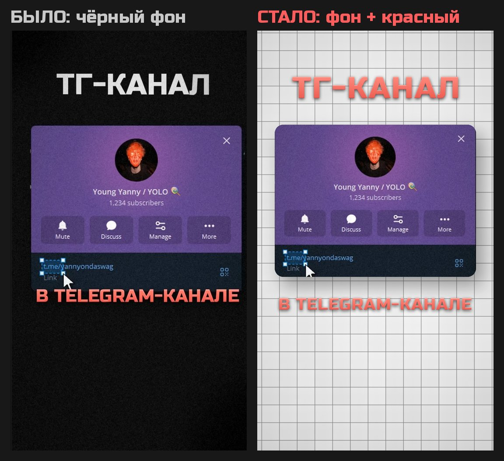
*Слева твой кадр: карточка ТГ висит на чёрном, заголовок белый. Справа то же по гайду: фон «белая плитка», карточка со скруглением и тенью, заголовок и субтитры красные.*

### 7.1 Четыре фона

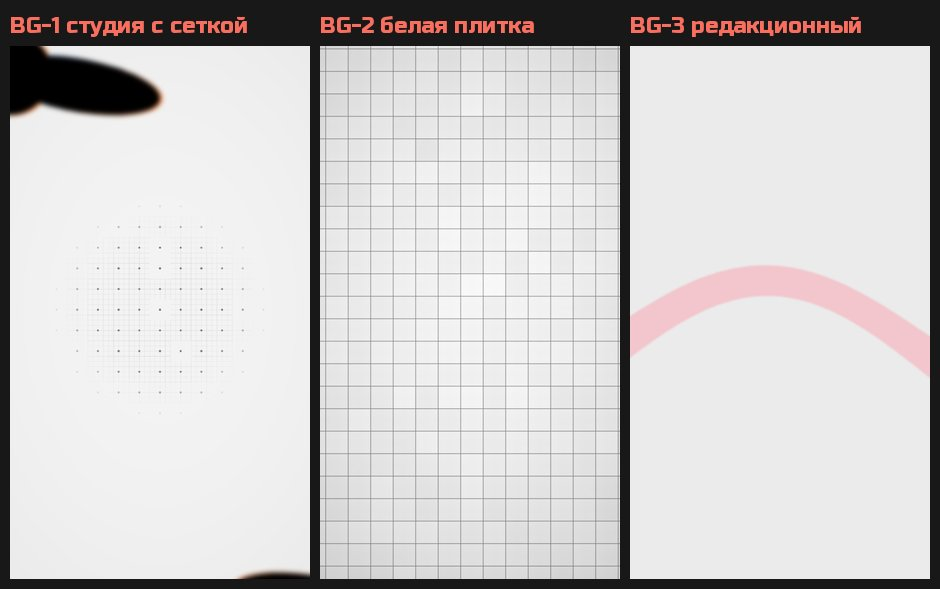
*Готовые фоны 1080×1920 из `assets/montage/backgrounds/`. На BG-1 наложены две «лопасти» из `fg-blob-01.png`.*

| | Образец | Файл | Когда |
|---|---|---|---|
| **BG-1 «Студия с сеткой»** | 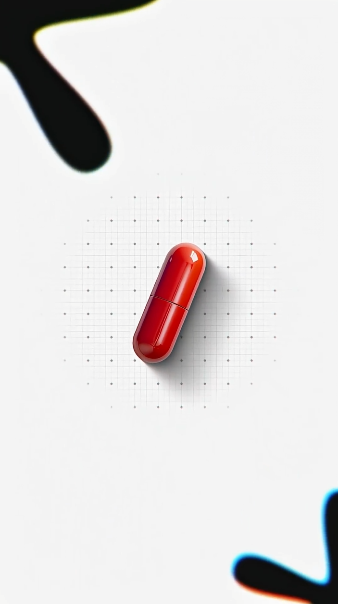 | `backgrounds/bg-01-studio-dotgrid.png` + `fg-blob-01.png` | Один предмет, иконка, логотип плагина, окно программы, результат эффекта |
| **BG-2 «Стол сверху»** | 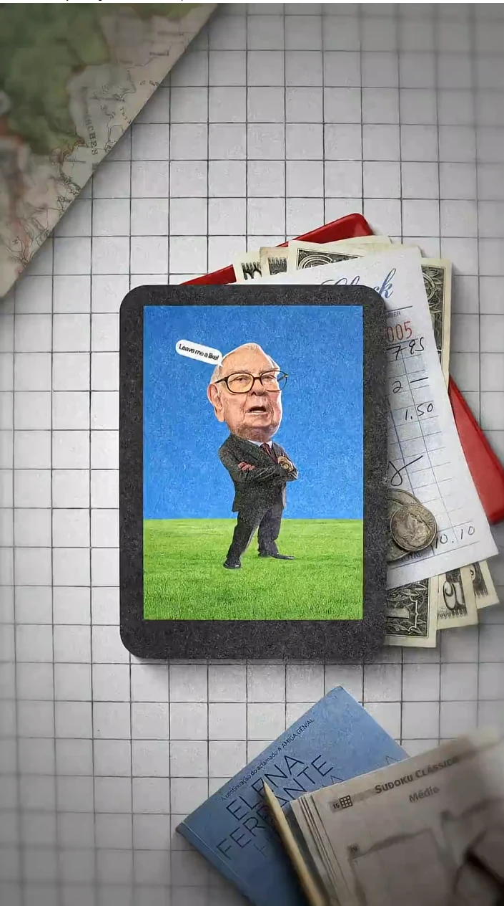 | `backgrounds/bg-02-white-tiles.png` + твои предметы | Скрины, ссылки, профили, ТГ-канал, посты, видео-примеры в рамке планшета или телефона |
| **BG-3 «Редакционный»** | см. V3, V8 ниже | `backgrounds/bg-03-editorial-ribbon.png` | Портреты, мокап телефона, тезисы, фото-монтаж |
| **BG-4 «Светлый бетон или бумага»** | см. V16 ниже | Фото светлой поверхности со стока, осветлённое | Разборы «что внутри», разрезы, спокойные сцены |

**BG-1 «Студия с сеткой»** (скрин 4, референс B):
- фон **#F4F4F4**, свет чуть ярче в центре;
- под объектом сетка: **точки 5 px (#8C8C8C) с шагом 74 px** и тонкие линии (#E0E0E0) с шагом 18–19 px. Сетка растворяется «ступеньками» к краям, диаметр около 700 px;
- в двух противоположных углах (слева сверху и справа снизу) чёрные **«лопасти»** (`fg-blob-01.png`), обрезанные краем кадра, с **сине-оранжевой каймой** (хроматическая аберрация). За сцену лопасти медленно поворачиваются на 10–20° и двигаются в 1,5 раза быстрее объекта (параллакс);
- объект в центре (y ≈ 900–950) с тенью вправо вниз.

**BG-2 «Стол сверху»** (скрин 3, референс C):
- поверхность сверху: **белая плитка** с тёмными швами (клетка около 80 px) или бумага в клетку. Свет сверху слева, углы чуть темнее;
- контент в **рамке планшета**: толстая тёмная рамка **#2A2A2A** с фактурой войлока, скругление 40 px, тень 35 %;
- по краям лежат **предметы**, частично срезанные краем кадра. Сверху слева карта или лист бумаги, справа под планшетом купюры, чеки, красный блокнот, монеты. Снизу книга, карандаш, стикеры. Все тени падают в одну сторону;
- предметы подбираем по теме. Монтаж: наушники, мышь, SD-карта, стикеры, флешка. Деньги: купюры, чеки, монеты. Рэп: кассета, микрофон, винил, цепь. Соцсети: телефон, стикеры;
- 💡 **Лучший вариант: сними свой стол сверху** на телефон при дневном свете и вырежи предметы. Будет живо и узнаваемо.

**BG-3 «Редакционный»** (референс A): ровный **#EBEBEB**, широкая изогнутая бледно-розовая лента **#F2C6CC** за объектом, по углам размытые чёрные «лепестки».

**BG-4 «Светлый бетон или бумага»** (светлая часть референса D): светлая поверхность с мягким светом сверху. Фактура только из фото поверхности, шум сверху не добавляем.

### 7.2 Правила подачи контента

- **Контент всегда в рамке:** карточка со скруглением **28–40 px**, мокап телефона, рамка планшета или окно программы. Голый скрин на весь экран не ставим.
- **Тень у рамки:** чёрная 25–38 %, Distance 30–45 px вправо вниз, Softness 60–100 px.
- **Ширина рамки:** 70–85 % кадра (760–920 px). Низ рамки не ниже y ≈ 1140, чтобы не наезжать на субтитры.
- **Фон и рамка двигаются:** камера наезжает 100 → 104 %, фон отстаёт (параллакс 0,5×).
- **Тёмный фон** допустим только в коротких акцентах **без показа контента**: круговая шторка (TR5), прожектор (V12), не дольше 1–2 с.

### 7.3 Рецепт: сцена «ТГ-канал» по гайду

1. Фон BG-2 (плитка) или BG-1.
2. Скрин карточки ТГ → прекомпоз. Скругление 36–40 px (Shape Layer «Rounded Rectangle» как Alpha Matte), тень по 7.2.
3. **Карточка въезжает снизу:** Position y +300 → 0, Scale 92 → 100 %, Blur 20 → 0, поворот −3° → 0°, 12 кадров, Apple ease-out.
4. **Заголовок «ТГ-КАНАЛ»:** красный Russo One 140 px, y ≈ 260, по буквам (T1). Стартует на 4 кадра позже карточки.
5. **Курсор и рамка выделения на ссылке** (T5), на клик SFX.
6. **Субтитры** красные на y ≈ 1210, под карточкой.
7. **Камера:** наезд 100 → 104 % за всю сцену.
8. **SFX:** скольжение по столу на въезд карточки, поп на заголовок, клик мыши на ссылку. Всё на −12…−14 dB.

---

## 8. Вставки моушн-графики

### 8.1 Сколько вставок

| Правило | Значение |
|---|---|
| **Частота** | Вставка каждые **3–6 с** |
| **Доля в ролике** | **50–60 %** хронометража занимают вставки |
| **Спикер без вставки подряд** | Не дольше **4–5 с**. Исключение: хук и призыв к действию, где важно лицо |
| **Длина одной вставки** | 1,5–4 с. Внутри что-то новое каждые 0,3–1 с |
| **Повод для вставки** | Каждая цифра, название (программа, плагин, рэпер, клип), предмет, «до и после», ссылка, перечисление, главный тезис |
| **Речь под вставкой** | Голос продолжается, субтитры остаются |
| **Повторы** | Один и тот же шаблон два раза подряд не ставим |

### 8.2 Что говорит спикер → какая вставка

| Спикер говорит про… | Вставка |
|---|---|
| Скрин, сайт, ТГ, профиль, пост, ссылку | **V1** экран на столе |
| Один предмет, плагин, эффект, программу | **V2** объект на сетке |
| Вертикальное видео, эдит, TikTok, клип | **V3** мокап телефона |
| Человека: рэпера, клиента, себя | **V4** портрет в круге или **V8** портрет в рамке |
| Цифру: цену, просмотры, часы, подписчиков | **V5** наклейки-счётчик |
| Деньги, объём, «много всего» | **V6** летящие объекты |
| Главную мысль ролика | **V7** тезис-карточка или **V10** слова стопкой |
| Вещь: сетап, одежду, технику | **V9** 3D на постаменте |
| Шаги в After Effects | **V13** окно программы |
| Сравнение | **V14** до и после |
| Перечисление | **V15** быстрый фото-монтаж |
| «Что внутри», разбор, секрет | **V16** разрез |
| Вывод, итог | **V11** итог-карточка |
| Драматичное раскрытие (1 раз за ролик) | **V12** прожектор |

### 8.3 Шаблоны вставок

Все тайминги для 30 fps. Все надписи красным Russo One (кроме мелкого курсива, см. [раздел 10](#10-типографика-на-вставках)). Звуки по [разделу 15](#15-звук-и-sfx).

---

#### V1. Экран на столе сверху


- **Когда:** показываем скрин, ссылку, ТГ, профиль, пост, пример видео.
- **Фон:** BG-2 (плитка + предметы по теме).
- **Сборка:** контент в рамке планшета (тёмная войлочная рамка #2A2A2A, скругление 40 px) по центру, y ≈ 750–850. Над ним красный заголовок.
- **Анимация:** рамка въезжает снизу за 12 кадров (y +300 → 0, поворот −3° → 0°, Blur 20 → 0). Предметы по краям чуть сдвигаются (параллакс). Потом курсор и рамка выделения на нужном месте (T5).
- **SFX:** скольжение по столу → клик.

#### V2. Объект на студийной сетке
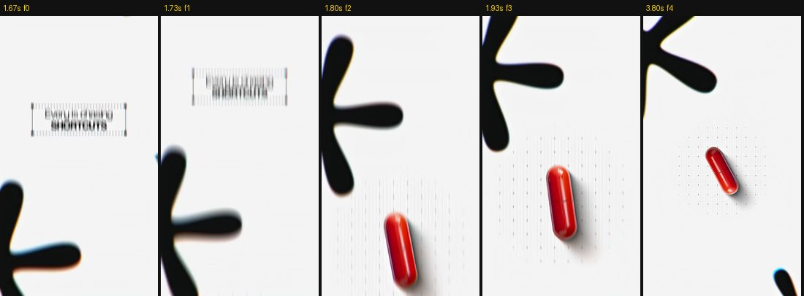
- **Когда:** один предмет или иконка: логотип плагина, результат эффекта, «вот эта штука».
- **Фон:** BG-1 (сетка + лопасти в углах).
- **Сборка:** объект по центру с тенью вправо вниз, под ним сетка точек.
- **Анимация:** сцена приходит из расфокуса (TR3). Объект влетает с Blur 20 → 0 и Scale 110 → 100 % за 10 кадров, потом медленно поворачивается на 15–25° за 2 с. Лопасти медленно вращаются.
- **SFX:** мягкий поп или «тик» на появление объекта.

#### V3. Мокап телефона
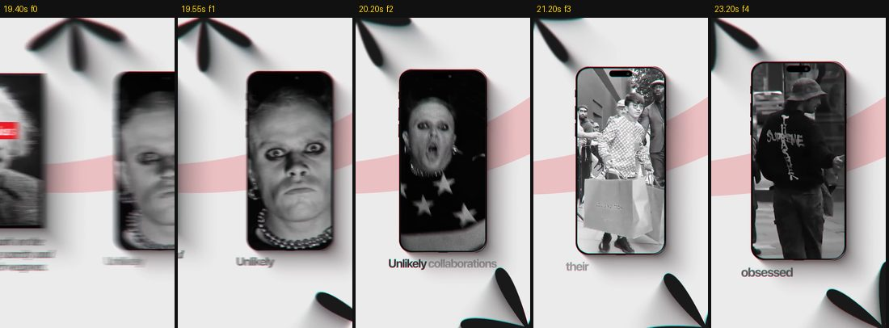
- **Когда:** вертикальные видео, эдиты, клипы, соцсети.
- **Фон:** BG-3 (#EBEBEB + розовая лента) + лепестки в углах.
- **Сборка:** телефон с тонким розовым или красным ободком, скругление экрана 44 px, тень. Подпись снизу: курсив + красное слово.
- **Анимация:** предыдущая сцена уезжает влево, телефон въезжает справа (TR10, 10 кадров). Содержимое экрана меняется каждые 0,7–1 с жёсткой склейкой.
- **SFX:** свуш на въезд, тихий «тик» на каждую смену экрана.

#### V4. Портрет в круге с пунктиром
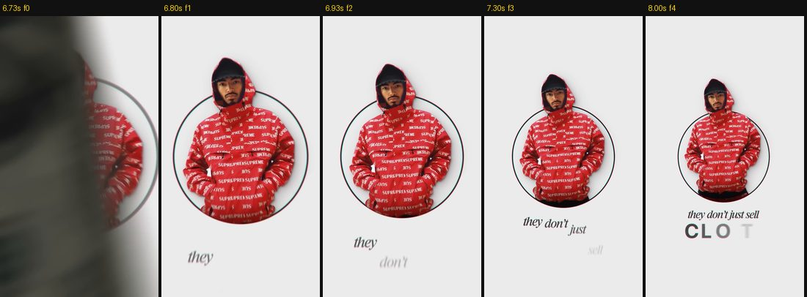
- **Когда:** человек: рэпер, клиент, автор, ты сам.
- **Фон:** BG-3.
- **Сборка:** вырезанный человек в круге диаметром 520–600 px, голова выходит за край круга. Тонкое кольцо 2–3 px (#3A3936) и пунктир вокруг. Ниже подпись: курсив + красное слово.
- **Анимация:** круг появляется из размытия, кольцо рисуется Trim Paths за 12 кадров, подпись по словам (T1).
- **SFX:** мягкий «вууш» + тик.

#### V5. Наклейки-счётчик
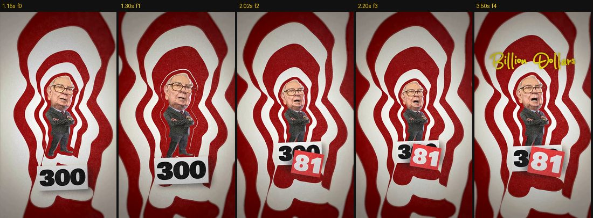
- **Когда:** любая цифра: цена, просмотры, подписчики, часы работы.
- **Фон:** яркий графичный (в референсе красно-белая гипно-мишень) или BG-2.
- **Сборка:** вырезанный человек или объект с белой обводкой-наклейкой. Цифры на бумажных наклейках: белая карточка с красными цифрами Russo One.
- **Анимация:** новая наклейка «шлёпается» поверх старой за 2–3 кадра (Scale 125 → 100 %, поворот −8…+6°). Старые цифры частично видны. Слово-подпись рукописно (T8).
- **SFX:** шлепок бумаги или штамп на каждую наклейку, «ка-чинг» на финальную цифру.

#### V6. Летящие объекты
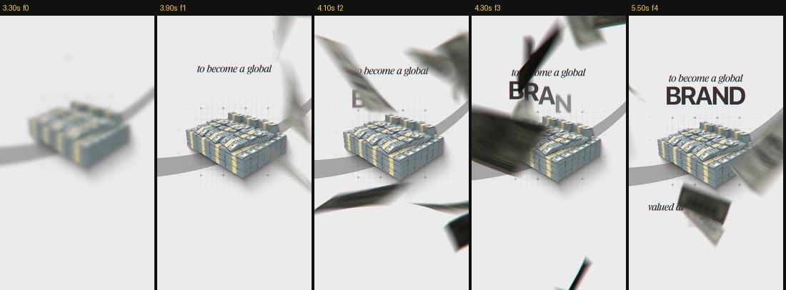
- **Когда:** деньги, «много», объём работы (файлы, кадры, заказы).
- **Фон:** BG-3.
- **Сборка:** центральный объект (пачки денег, стопка файлов) на изогнутой ленте. Сверху летят такие же объекты с сильным моушн-блюром.
- **Анимация:** объекты летят сверху вниз и мимо камеры 1–2 с. Заголовок появляется «кувырком» (T2) сквозь поток. Выход: объект летит в камеру и закрывает кадр (TR4).
- **SFX:** шелест купюр или бумаги, пролёт мимо.

#### V7. Тезис-карточка с объектом
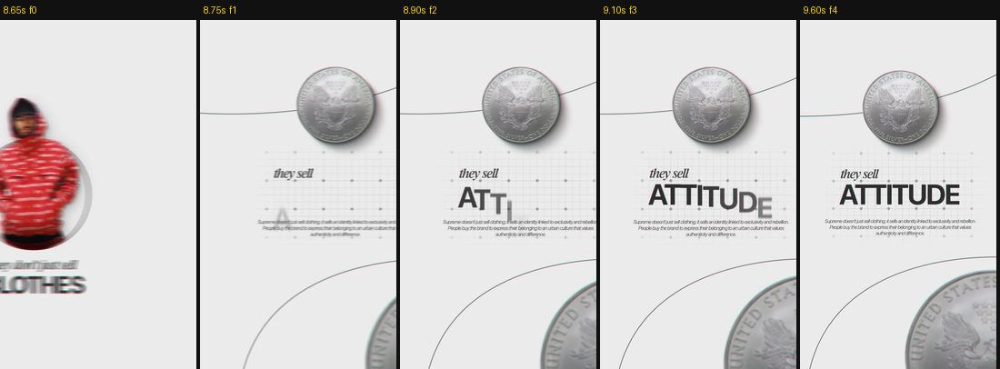
- **Когда:** главная мысль ролика, правило, вывод шага.
- **Фон:** BG-3 или BG-4 + тонкие дуги-«орбиты» и сетка из крестиков под текстом.
- **Сборка:** объект сверху (монета, иконка), в центре «шёпот + крик»: курсив + крупное красное слово. Под ним абзац-декор мелким текстом.
- **Анимация:** камера плавно переезжает на сцену (TR10). Курсив по словам, крупное слово по буквам (T1), абзац строкой.
- **SFX:** тик на курсив, удар или поп на крупное слово.

#### V8. Портрет в рамке с плашкой
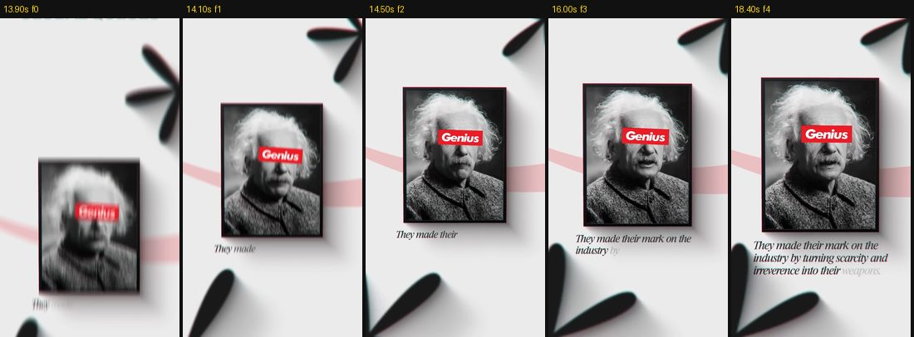
- **Когда:** цитата, пример автора, «он сделал Х».
- **Фон:** BG-3.
- **Сборка:** фото в тонкой тёмной рамке с красным отливом, тень. Поверх плашка (на глазах или внизу): белая с одним красным словом Russo One. Под рамкой 2–3 строки курсивом.
- **Анимация:** рамка въезжает снизу с моушн-блюром (TR2). Строки курсива появляются по словам в речь.
- **SFX:** свуш, «тик» на плашку.

#### V9. 3D-объект на постаменте
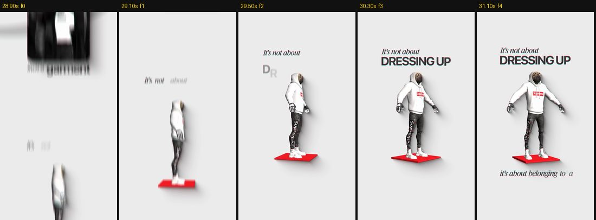
- **Когда:** сетап, одежда, техника, персонаж.
- **Фон:** BG-3 или BG-1.
- **Сборка:** 3D-модель или вырезанный объект на красной плоской плите #DE242F, мягкая тень. Сверху курсив + крупное слово, снизу вторая строка.
- **Анимация:** объект приходит вертикальным рывком (TR2), потом медленно поворачивается (Y-rotation 30–60° за 2 с). Крупное слово по буквам.
- **SFX:** свуш, лёгкий свип на поворот.

#### V10. Слова стопкой в рамке из предметов
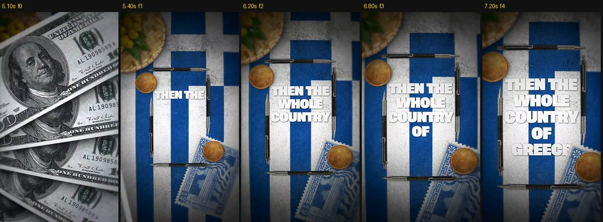
- **Когда:** ударная фраза из 3–6 слов.
- **Фон:** BG-2 или фон по теме (флаг, фото места) + рамка из реальных предметов: ручки, линейки, карандаши.
- **Сборка:** по одному слову на строку, красный Russo One 110–130 px, строки вплотную (интерлиньяж 90–95 %).
- **Анимация:** каждое слово появляется **в момент произнесения**: Scale 115 → 100 %, Blur 10 → 0, 4–6 кадров (T7).
- **SFX:** глухой «тук» на каждое слово, высота каждого следующего на полтона выше.

#### V11. Итог-карточка
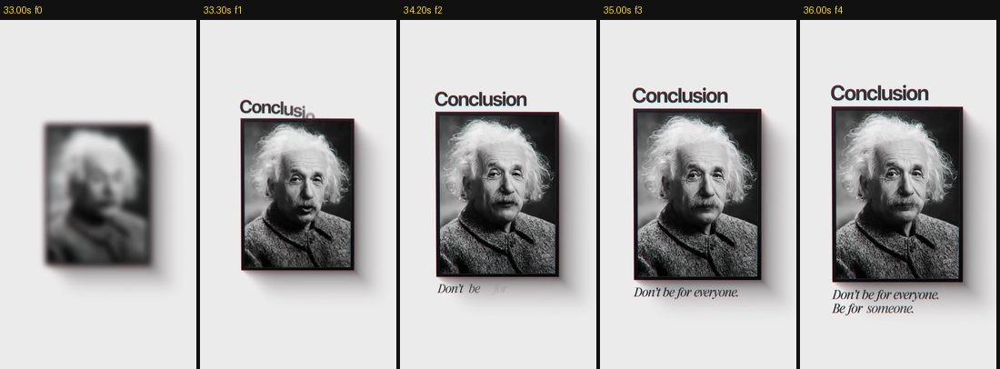
- **Когда:** финал, вывод ролика.
- **Фон:** BG-3.
- **Сборка:** заголовок «ВЫВОД» (красный Russo One), под ним фото или кадр в рамке с тенью, под рамкой 1–2 строки курсивом.
- **Анимация:** приход через расфокус (TR3), заголовок по буквам, строки по словам.
- **SFX:** мягкий «донг» или аккорд-стингер.

#### V12. Прожектор (акцент, без показа контента)
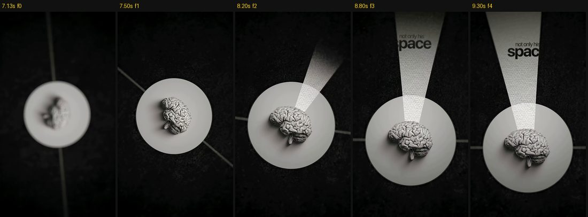
- **Когда:** одно драматичное раскрытие за ролик. Скрины и интерфейс так **не показываем**.
- **Фон:** тёмная сцена со светлым кругом света. Не дольше 1,5–2 с.
- **Анимация:** приход склейкой по форме (TR8). Луч вращается и открывает красное слово (T10), камера отъезжает.
- **SFX:** райзер → удар.

#### V13. Окно программы (шаги в After Effects)
- **Когда:** любой шаг туториала. **Заменяет запись экрана AE на весь экран.**
- **Фон:** BG-1.
- **Сборка:** запись экрана в плавающем окне со скруглением 20 px и тенью, ширина 900 px. Над окном заголовок «ШАГ 1», «ШАГ 2» (красный Russo One).
- **Анимация:** окно въезжает снизу (12 кадров). Камера плавно наезжает на нужную панель (Scale 100 → 170–200 %, 0,6 с, ease-in-out). Курсор и рамка выделения на параметре (T5). Новое значение параметра появляется наклейкой (T9).
- **SFX:** скольжение → клики мыши → поп на значение.

#### V14. До и после
- **Когда:** сравнение: было / стало, плохо / хорошо, CapCut / AE.
- **Фон:** BG-1 или BG-2.
- **Сборка:** две карточки рядом (по 420 px) или одна карточка с вертикальным разделителем, который тянет курсор. Подписи **«ДО»** и **«ПОСЛЕ»** красным Russo One над карточками.
- **Анимация:** карточки въезжают с разных сторон со смещением 4 кадра. Разделитель едет слева направо 0,8 с (ease-in-out).
- **SFX:** два свуша (разные) → «рип» или свип на разделитель.

#### V15. Быстрый фото-монтаж

- **Когда:** перечисление: «рэперы, клипы, бренды», «вот 20 моих работ».
- **Фон:** BG-3.
- **Сборка:** одна карточка со скруглением на месте, фото внутри меняются.
- **Анимация:** новое фото каждые **3–5 кадров**. Над карточкой текст продолжает появляться по словам.
- **SFX:** тихие щелчки затвора или тики в ритм, лучше одна «очередь», а не звук на каждое фото.

#### V16. Разрез

- **Когда:** «что внутри», разбор, секрет эффекта.
- **Фон:** BG-4 (светлый бетон или бумага).
- **Сборка:** фото или кадр в рамке с восьмиугольными углами. Разрезается по вертикали, половины разъезжаются, из щели выезжает объект. Тонкие линии соединяют объект с половинами.
- **Анимация:** 15–18 кадров на разрез, потом крупное слово сверху (T1).
- **SFX:** «рип» бумаги или механический щелчок → удар.

---

## 9. Библиотека анимаций текста

Все варианты базовой Apple-анимации из раздела 6. Цвет текста **красный** (стиль 5.2), кроме мелкого курсива.

### T1. Мелкий курсив по словам → крупное слово по буквам (A)

- Сначала мелкая строка курсивом по словам, в темп речи. Через 3–5 кадров крупное красное слово появляется по буквам.
- Буква появляется бледной и размытой, за 7 кадров наливается цветом и становится резкой. Шаг 2 кадра.
- Блок текста всё время чуть дрейфует вместе с камерой.

### T2. «Кувырок» букв (A: RED LOGO, BRAND)

- Буквы влетают снизу с поворотом: Position 0,+40, **Rotation 20–25°**, Opacity 0, Blur 12 → всё в 0. По символам, шаг 2 кадра, 8 кадров на букву.
- Разнобой углов даёт второй селектор: **Wiggly Selector**, Mode: Intersect, Wiggles/Second 0, Based On: Characters.
- Не чаще 1–2 раз за ролик.

### T3. Крупное слово «встаёт» из размытия (B: TRUTH)

- Слово целиком: Scale 110 → 100 %, Blur 28 → 0, Opacity 0 → 100 %, 13 кадров.
- Цвет «наливается»: от бледно-розового **#FFC2BA** к красному градиенту 5.2 (Fill Color в аниматоре).
- Над ним мелкая строка курсивом появляется на 4–6 кадров раньше.

### T4. Слова по одному, двумя строками (C)

- Так ведут себя субтитры: слово за словом точно в речь, размытие + подъём на 20 px, 6–8 кадров на слово. Цвет у нас красный, а не золотой, как в референсе.

### T5. Курсор и рамка выделения, как в Figma (B)

- Курсор (чёрная стрелка на светлом фоне) въезжает за 6–8 кадров с ease-out.
- Курсор тянется по диагонали, и за ним растягивается **рамка выделения**: пунктир 1,5 px (штрих 4, пробел 4), синий **#2F80ED** или графитовый, по углам квадратные маркеры 8×8 px с белой заливкой.
- Текст внутри проявляется по буквам **вместе с ростом рамки**.
- **Замена слова:** курсор выделяет старое слово, и оно меняется на новое красное за 4–6 кадров.
- 🔥 Ты уже используешь этот приём (ссылка в ТГ). Ставь его на каждое название параметра, эффекта и ссылки.

### T6. Текст по дуге вокруг объекта (B: «no magic pill»)
- Текст на круговом пути (Path Options → Path), радиус = радиус объекта + 50–70 px, дуга над объектом.
- Появление по символам слева направо, 0,6 с на всю фразу. Цвет каждой буквы идёт от бледно-розового к красному.

### T7. Слова стопкой (C) — см. V10

### T8. Рукописная надпись (C: «Billion Dollars»)
- Рукописный шрифт с кириллицей: **Caveat Bold** или **Marck Script**, красный **#EE5E52**.
- Появляется «написанием»: маска + Stroke или Trim Paths по контуру, 0,6–0,8 с, стартует на слово в речи.

### T9. Цифра-наклейка (C: 300 → 381) — см. V5
- Белая бумажная наклейка с красными цифрами Russo One, «шлёпается» за 2–3 кадра (Scale 125 → 100 %, поворот −8…+6°), тень.

### T10. Текст, открытый лучом света (D: «not only his space») — см. V12
- Текст виден **только внутри светового конуса** (Track Matte на форму луча). Луч вращается 1–1,5 с, ease-in-out.

---

## 10. Типографика на вставках

### 10.1 Шрифты (все с кириллицей)

| Роль | Шрифт | Цвет | Размер |
|---|---|---|---|
| **Субтитры, заголовки, крупные слова** | **Russo One** | Красный градиент 5.2 | 76–150 px |
| **Мелкий курсив-«шёпот»** | Playfair Display Italic (запасной: Cormorant Garamond Italic, PT Serif Italic) | Графит **#3A3936** | 34–44 px, строчные |
| **Абзац-декор** под объектом | Inter Regular | Серый **#6B6B6B** | 18–22 px, 3–4 строки по центру |
| **Рукописный акцент** | Caveat Bold | Красный **#EE5E52** | 1–2 раза за ролик |

Белого текста нет нигде. Максимум три шрифта в ролике: Russo One + курсив + (абзац или рукописный).

### 10.2 Компоновка «шёпот + крик»

```
         с сегодняшнего            ← курсив, 38 px, графит #3A3936
     ВСЁ  ИНАЧЕ                    ← Russo One, 120 px, красный
```
- Курсив стоит **над крупным словом** и чуть заходит на его левую часть. Между строками 0–8 px, почти впритык.
- Иногда курсив стоит **под** объектом, а крупное слово ещё ниже (A: *went from being a small* **SKATESHOP**).
- Курсивом пишем служебные слова и связки, крупным — одно-два смысловых слова.
- Ещё не появившиеся слова курсива можно показывать бледно-серыми (**#B5B5B5**), тогда предложение «наливается» по мере речи.

### 10.3 Раскладка кадра вставки

| Зона | y (px) | Что стоит |
|---|---|---|
| Заголовок | **250–320** | Красный Russo One 130–150 px |
| Верхний текстовый блок | **450–650** | Курсив + крупное слово |
| Главный объект или карточка | центр **≈ 800–950**, низ не ниже 1140 | Фото, 3D, мокап, рамка со скрином |
| Субтитры | **≈ 1210** | Красные, всегда |

---

## 11. Визуальный язык

### 11.1 Общие правила

- **Один главный объект в центре.** Вокруг пусто: 40–60 % кадра остаётся фоном.
- **Тень у каждого объекта:** чёрная **25–35 %**, Angle 135° (вправо вниз), Distance 25–60 px, Softness 60–120 px. Тень длинная и мягкая, как от студийного софтбокса.
- **Цвет:** фото и скрины в естественном цвете (раздел 4).
- **Акцентный цвет в сцене один:** красный. Синий допускается только в UI-элементах (рамка выделения, ссылка в скрине).
- **Глубина:** лопасти и лепестки по углам, размытые (Camera Lens Blur 20–60) с сине-оранжевой каймой 2–3 px. Кайма только на них, не на видео.
- **Графика:** пунктирные круги вокруг объектов (штрих 2–3 px, #3A3936, пунктир 6/6, рисуются Trim Paths); сетка точек или крестиков под объектом; тонкие дуги-«орбиты»; изогнутые ленты за объектом.
- **Без** шума, зерна, растра и виньетки поверх видео.

### 11.2 Палитра

| Имя | HEX | Где |
|---|---|---|
| Субтитры, верх градиента | `#FF8A7E` | Заливка текста |
| Субтитры, низ градиента | `#EE5E52` | Заливка текста |
| Субтитры, средний тон | `#F86F60` | Если градиент недоступен (CapCut) |
| Фаска, тёмный край | `#C34D4E` | Bevel |
| Красный акцент графики | `#DE242F` | Постаменты, плашки, ленты |
| Бледно-розовый | `#FFC2BA` / `#F2C6CC` | Старт «наливания» текста, ленты фона |
| Графит | `#3A3936` | Курсив, кольца, линии |
| Серый бледный | `#B5B5B5` | Ещё не появившиеся слова, сетка |
| Фон студии | `#F4F4F4` | BG-1 |
| Фон редакционный | `#EBEBEB` | BG-3 |
| Рамка планшета | `#2A2A2A` | BG-2 |
| Синий UI | `#2F80ED` | Только рамка выделения (T5) |

---

## 12. Камера и движение

| Приём | Параметры | Где в референсах |
|---|---|---|
| **Постоянный медленный наезд** | Scale 100 → 104 % за 3 с, ease-in-out. В каждой сцене | A, B, D |
| **Дрейф** | Position ±15–30 px за сцену, или `wiggle(0.4, 8)` на нуле-камере | A: блок текста и объект плывут |
| **Параллакс** | Передний план (лопасти, лепестки) двигается в 1,5–2 раза быстрее объекта, фон в 0,5 раза | A, B |
| **Поворот камеры** | Rotation 0 → 15–20° за 2 с, ease-in-out | D: сцена с глазом |
| **Отъезд с раскрытием** | Scale 100 → 45 % за 3–4 с: из крупного плана открывается общая картина | D, 9,5–13 с |
| **Фокус «вытягивается»** | Сцена начинается размытой (Blur 20 → 0 за 8–10 кадров) | A: сцены с деньгами и курткой |
| **Спикер** | Наезд 100 → 104 % на куске; на соседних склейках крупность чередуется 100 % ↔ 112 % | — |


**Правило:** в кадре нет ни одной полностью статичной секунды.

---

## 13. Переходы

Каждый переход сопровождается SFX (раздел 15). Пик звука приходится на кадр склейки.

### TR1. Жёсткая склейка в бит (по умолчанию)
- Склейка на удар или сильную долю. В B две склейки из трёх попадают в удар с точностью до 1 кадра.

### TR2. Вертикальный рывок с моушн-блюром (A)

- Сцена уезжает вверх, новая приходит снизу. Directional Blur 90°, 60–120 px на пике. **8–10 кадров**, ease-in-out.

### TR3. Расфокус (A)

- Старая сцена: Blur 0 → 40, Scale 100 → 96 % за **6 кадров** (ease-in). Склейка. Новая: Blur 40 → 0 за **8 кадров** (ease-out). Для смены темы.

### TR4. Объект закрывает кадр (A: купюры)

- Предмет из сцены летит в камеру и закрывает кадр на 1–2 кадра, под ним склейка. **6–8 кадров**.

### TR5. Влёт в объект и круговая шторка (B)

- Камера наезжает на круглый объект, он подменяется похожим, вокруг раскрывается круг нового фона. **12–14 кадров.** Тёмный круг допустим только как короткий акцент.

### TR6. Пролёт объекта через кадр (B)

- Крупный размытый объект пролетает по диагонали, за ним уже новая сцена. **10–12 кадров.**

### TR7. Разрез (D) — см. V16

### TR8. Склейка по форме (D: глаз → световой круг)

- Круглый объект в конце сцены встаёт ровно на место круглого объекта следующей. Жёсткая склейка, но глаз её «не видит».

### TR9. Быстрый фото-монтаж — см. V15

### TR10. Горизонтальный сдвиг (A)
- Старая сцена уезжает влево, новая въезжает справа, обе с горизонтальным моушн-блюром. **8–10 кадров**, ease-in-out. См. первые кадры V3 и V7.

### Когда какой переход

| Ситуация | Переход |
|---|---|
| Внутри одной мысли, в бит | TR1 |
| Спикер → вставка | TR2, TR10, TR6 |
| Новая тема | TR3 |
| Есть подходящий предмет в кадре | TR4, TR8 |
| Разбор, «что внутри» | TR7 |
| Перечисление | TR9 |

---

## 14. Ритм и тайминг

| Метрика | Правило |
|---|---|
| Паузы в речи | **Нет** (раздел 3) |
| Длина сцены между переходами | **1,5–5 с**, в среднем около 3 с |
| Вставки | Каждые 3–6 с, 50–60 % ролика |
| Как часто в кадре что-то новое | **Не реже раза в секунду** |
| Первый кадр | Движение с первого кадра. Обложка на 5–10 кадров допустима, чёрный в начале нет |
| Быстрый монтаж | 3–5 кадров на фото, только для перечислений |
| Финальная удержка | 1–2 с на последнем смысловом кадре |
| Концовка | Петля **или** короткая фирменная заставка (у тебя это 🐸, см. `shorts-plan.md`) |

**Петля (как в B):** последний кадр по композиции и звуку совпадает с первым. Зритель не замечает конца и досматривает ролик повторно.

---

## 15. Звук и SFX

### 15.1 Уровни

| Дорожка | Уровень |
|---|---|
| **SFX** | **Всегда −12…−14 dB** по пику индикатора. Не громче и не тише |
| Голос | Пики −6…−3 dB, компрессия 3:1, де-эссер, срез ниже 80 Гц |
| Музыка под голосом | На **18–22 dB** тише голоса |
| Итог (мастер) | **−14 LUFS**, пик −1 dBTP |

- Если SFX на −12…−14 dB перекрывает слово, **уровень не трогаем**: сдвигаем звук на 2–4 кадра к краю слова или берём более короткий или высокий вариант.
- Двухслойный звук на крупный переход (свуш + удар): **каждый слой** на −14 dB.

### 15.2 Библиотека SFX по событиям

Для каждого события держи **4–6 вариантов** и чередуй их.

| Событие | Варианты |
|---|---|
| **Рывок и сдвиг** (TR2, TR10) | короткий воздушный свуш; свуш с басом; свип-свуш; реверс-свуш, нарастающий в склейку; «свайп» ткани |
| **Расфокус** (TR3) | мягкий «вууш» с ревером; воздушный пэд-свип; свуш с «блеском» (shimmer) |
| **Пролёт и объект в камеру** (TR4, TR6, V6) | пролёт мимо (fly-by); шелест купюр; бумажный свуш; быстрый «swish» |
| **Появление крупного слова** (T1–T3) | мягкий поп; UI-тик; глухой «тук» (thump); стеклянный «дзынь»; одиночная клавиша печатной машинки |
| **Наклейка и цифра** (V5, T9) | шлепок бумаги; штамп; «ка-чинг» кассы; щелчки счётчика; звон монеты |
| **Курсор и интерфейс** (T5, V13) | клик мыши; клик трекпада; звук выделения; 2–3 нажатия клавиатуры; звук уведомления |
| **Карточка въезжает** (V1, V13, V14) | скольжение по столу; шорох бумаги; мягкий «тук» при остановке |
| **Разрез и раскрытие** (V16) | «рип» бумаги; механический щелчок; райзер → удар |
| **Главный момент** (1–2 раза за ролик) | райзер 0,5–1 с → удар с сабом; «бум» с хвостом |
| **Вращение, 3D** (V9, V2) | лёгкий свип; механический поворот; тихий гул |
| **Юмор, ошибка** | скретч пластинки; «бзз» ошибки; щелчок затвора |
| **Вывод** (V11) | мягкий «донг»; аккорд-стингер |

### 15.3 Правила разнообразия

- **Один и тот же файл два раза подряд не звучит.** Одинаковые звуки ставим не чаще чем через 3–4 других.
- **Меняй высоту:** при повторе сдвигай звук на ±1–2 полутона (Pitch Shifter). Звучит как новый.
- **Плотность:** 1–2 SFX в секунду максимум, иначе каша.
- **Слова субтитров не озвучиваем** по отдельности. Звук только на заголовки, акценты, объекты и переходы.
- **Где брать:** бесплатно Pixabay Sound Effects, Freesound (смотри лицензию CC0 или CC-BY), YouTube Audio Library. Платно Artlist, Epidemic Sound.

### 15.4 Музыка

- Подложка без слов, в референсах тянущаяся нота и частые перкуссионные щелчки.
- Склейки в удары (±1 кадр).
- Под голосом музыка на 18–22 dB тише, на вставках без речи поднимается.

---

## 16. Шаблон ролика на 35 секунд

| Время | Видео | Текст | Анимация и переходы | SFX (−12…−14 dB) |
|---|---|---|---|---|
| 0,0–0,3 | Обложка: объект + крупное слово | Красный заголовок | — | Удар |
| 0,3–2,0 | **Хук:** ты крупно, наезд | Субтитры, акцент на главном слове | T1 на слово | Удар с сабом на ключевое слово |
| 2,0–4,5 | **V2:** результат эффекта на сетке | Субтитры | TR2 → вставка | Свуш с басом, поп |
| 4,5–7,0 | Ты в кадре | Субтитры | TR1 в бит | — |
| 7,0–10,0 | **V13:** шаг 1 в окне AE | «ШАГ 1» + субтитры | T5 на параметр | Скольжение, клик |
| 10,0–12,0 | Ты в кадре | Субтитры | TR10 | Свип-свуш |
| 12,0–15,0 | **V13 + V5:** шаг 2, значение наклейкой | «ШАГ 2» + субтитры | T9 | Клик, шлепок бумаги |
| 15,0–17,0 | Ты в кадре | Субтитры | TR1 | — |
| 17,0–20,0 | **V13:** шаг 3 | «ШАГ 3» + субтитры | T5 | Клавиатура, выделение |
| 20,0–23,0 | **V14:** до и после | «ДО / ПОСЛЕ» | Разделитель тянется | Два разных свуша, «рип» |
| 23,0–26,0 | Ты в кадре | Субтитры | TR3 | Мягкий «вууш» |
| 26,0–29,0 | **V10:** главная мысль стопкой | Слова в речь | T7 | «Тук» на каждое слово, по нарастающей |
| 29,0–33,0 | **V1:** ТГ-канал на столе | «ТГ-КАНАЛ» + субтитры | Въезд карточки, T5 на ссылку | Скольжение, поп, клик |
| 33,0–35,0 | Ты, призыв к действию | Субтитры | → петля на первый кадр или 🐸-заставка | Удар или «донг» |

Вставки занимают около 20 с из 35 (≈ 57 %).

---

## 17. Порядок работы

1. **Сценарий.** Размечаешь, какие слова уйдут в заголовки и акценты, а какие места закроются вставками (таблица 8.2).
2. **Чистка речи** (раздел 3): все паузы, дубли, повторы и «вода» вырезаны. Прочитай транскрипт: логично?
3. **Цвет** (раздел 4): Lumetri с контрастом +10…+15, без шума.
4. **Звук:** голос почищен, музыка подложена, склейки в ударах.
5. **Субтитры** (разделы 5–6): транскрибация → SRT → маркеры в AE → выражения → красный стиль.
6. **Вставки** (разделы 7–8): каждые 3–6 с, на светлых фонах, контент в рамках.
7. **Переходы** (раздел 13).
8. **SFX** (раздел 15): на каждое событие, разные, все на −12…−14 dB.
9. **Проверка** по чек-листу → экспорт (раздел 2).

---

## 18. Чек-лист перед экспортом

**Речь**
- [ ] Пауз нет: нигде спикер не молчит дольше ~0,15 с
- [ ] Дубли, повторы, оговорки и «вода» вырезаны
- [ ] Транскрипт читается логично: хук → зачем → шаги → результат → призыв

**Субтитры**
- [ ] Каждое слово спикера на экране, проверено на слух
- [ ] Только красный Russo One, белых и других стилей нет
- [ ] Слова появляются в речь, без опозданий (проверено на 0,5×)
- [ ] 1–3 слова на экране, высота y ≈ 1210 одинаковая во всём ролике

**Вставки и фон**
- [ ] Вставка каждые 3–6 с, спикер подряд не дольше 4–5 с
- [ ] Всё, что показываем, стоит в рамке с тенью на светлом фоне, чёрного фона под контентом нет
- [ ] Один шаблон вставки не идёт два раза подряд
- [ ] Все надписи красные (кроме мелкого курсива и абзаца-декора)

**Анимация**
- [ ] Всё появляется через Apple ease-out: размытие + прозрачность + подъём, без отскоков
- [ ] Нет статичных кадров дольше 1 с
- [ ] Моушн-блюр включён

**Цвет**
- [ ] Картинка как исходник, чуть контрастнее и ярко
- [ ] Шума, зерна, растра и виньетки на видео нет

**Звук**
- [ ] Все SFX на −12…−14 dB
- [ ] Один и тот же SFX не звучит два раза подряд
- [ ] Свуш на каждом переходе, склейки в ударах
- [ ] Мастер −14 LUFS, пик −1 dBTP

**Концовка**
- [ ] Петля или фирменная заставка
- [ ] Первые 5–10 кадров годятся в обложку

---

## 19. Спецификация для ИИ и монтажёра (YAML)

```yaml
style_guide: young-yanny-montage-v1.1
canvas: { width: 1080, height: 1920, fps: 30, safe_zone: { x: [70, 950], y: [200, 1480] } }

rough_cut:
  pauses: none                     # вырезать все паузы, только речь
  max_silence_s: 0.15
  handle_frames: [2, 3]            # воздух у слова
  audio_crossfade_frames: 2
  remove: [retakes, repeated_ideas, self_corrections, filler_words, empty_phrases]
  keep_logic: "хук → зачем → шаги → результат → призыв"
  jump_cut_mask: { alternate_scale: [100, 112] }

color:
  base: "как исходник"
  lumetri: { contrast: [10, 15], highlights: [-10, -5], shadows: [0, 5], whites: [5, 10], blacks: [-10, -5], saturation: [100, 105], vibrance: [5, 10] }
  forbidden: [noise, grain, halftone_overlay, vignette_on_speaker, bw_speaker, teal_orange_lut, mosaic]

subtitles:
  required: true                   # вся речь спикера, всегда
  style_only: red_russo            # белых и других стилей нет
  font: "Russo One Regular"
  case: upper
  size_px: 80                      # 76–86
  accent_size_px: 96
  max_line_width_px: 920
  words_per_screen: [1, 3]
  max_chars_per_line: 18
  center_y_px: 1210
  lead_frames: 2
  fill_gradient: ["#FF8A7E", "#EE5E52"]   # сверху вниз, средний #F86F60
  bevel: { size_px: 3, highlight: "#FFFFFF@45%", shadow: "#C34D4E@58%" }
  drop_shadow: { color: "#000000", opacity: 0.7, angle: 90, distance_px: 5, size_px: 12 }
  titles: { same_style: true, size_px: [130, 150], center_y_px: [250, 320], reveal: by_letter }

text_animation_apple:
  easing_in: "cubic-bezier(0.22, 1, 0.36, 1)"
  easing_out: "cubic-bezier(0.55, 0, 1, 0.45)"
  word:   { frames: 9,  stagger: "по речи (≈3 кадра)", opacity: [0, 100], blur_px: [20, 0], y_px: [36, 0] }
  letter: { frames: 7,  stagger_frames: 2, opacity: [0, 100], blur_px: [12, 0], y_px: [24, 0] }
  hero_word: { frames: 13, scale: [110, 100], blur_px: [28, 0] }
  exit:   { frames: 4, opacity: [100, 0], blur_px: [0, 10], y_px: [0, -12] }
  forbidden: [overshoot, bounce, spring, linear_easing]

showing_content:                   # скрин, ссылка, профиль, интерфейс
  background_never_black: true
  backgrounds: [bg-01-studio-dotgrid, bg-02-white-tiles-desk, bg-03-editorial-ribbon, bg-04-light-concrete]
  frame: { corner_radius_px: [28, 40], width_px: [760, 920], bottom_max_y_px: 1140 }
  shadow: { opacity: [0.25, 0.38], distance_px: [30, 45], softness_px: [60, 100] }

inserts:
  every_s: [3, 6]
  share_of_video: [0.5, 0.6]
  max_speaker_only_s: 5
  length_s: [1.5, 4]
  no_same_template_twice_in_row: true
  templates: [V1_desk_screen, V2_object_dotgrid, V3_phone_mockup, V4_circle_portrait, V5_sticker_counter, V6_flying_objects, V7_thesis_card, V8_framed_portrait, V9_3d_plinth, V10_stacked_words, V11_conclusion, V12_spotlight_accent, V13_app_window, V14_before_after, V15_fast_montage, V16_split]

typography:
  hero_and_subtitles: "Russo One, красный"
  whisper: "Playfair Display Italic, #3A3936"
  body: "Inter Regular 18–22px #6B6B6B"
  script: "Caveat Bold, #EE5E52"
  white_text: forbidden

camera: { push_in: { scale: [100, 104], seconds: 3 }, never_static_over_s: 1.0 }
transitions: [hard_cut_on_beat, whip_vertical_8f, defocus_6f_8f, foreground_occluder_6f, zoom_through_circle_wipe_12f, object_pass_through_10f, split_reveal_16f, shape_match_cut, fast_photo_montage_3to5f, horizontal_push_8f]

audio:
  sfx_peak_db: [-14, -12]          # всегда
  voice_peak_db: [-6, -3]
  music_under_voice_db: [-22, -18]
  master: { lufs: -14, true_peak_dbtp: -1 }
  sfx_variants_per_event: [4, 6]
  no_same_sfx_twice_in_row: true
  pitch_variation_semitones: [-2, 2]
  max_sfx_per_second: 2

ending: [seamless_loop, brand_outro_1s]
```

---

## 20. Открытые вопросы

1. **В какой программе монтируешь:** After Effects, Premiere Pro или CapCut? Рецепты расписаны для AE. Могу подробно расписать под твою программу.
2. **Мелкий курсив-«шёпот»** на вставках я оставил графитовым (#3A3936): он не белый и хорошо читается на светлых фонах. Или тоже делать красным?
3. **−12…−14 dB для SFX** я записал как пик по индикатору. Если ты имел в виду громкость клипа (clip gain) в программе, скажи, и я поправлю.
4. **Фон «стол сверху»:** сможешь снять свой стол сверху с предметами? Тогда фон будет твоим, а не стоковым.
5. **Концовка:** петля или заставка с 🐸? Если заставка, пришли лого.
6. **Пришли один свой готовый ролик целиком:** сверю по нему цвет, звук и частоту вставок.

---

*Раскадровки в `assets/montage/refs/` и `assets/montage/inserts/` — кадры из референсов (A: Vane Motion, B–D: авторы неизвестны). Они лежат здесь только как образцы для разбора стиля. Фоны в `assets/montage/backgrounds/bg-*.png` и `fg-blob-01.png` сгенерированы для этого гайда и свободны для использования.*
