# Стиль монтажа: гайд для каждого ролика

*Для YOUNG YANNY · 27.09.2026 · вертикальные Shorts/Reels/TikTok · версия 1.0*

Этот файл описывает стиль монтажа, чтобы каждый ролик выглядел одинаково, кто бы его ни монтировал: ты, монтажёр или ИИ-помощник. Здесь есть точные цифры: цвета, кадры, кривые, размеры. И готовые рецепты для After Effects.

**Как пользоваться:**
- Нужен быстрый ориентир — читай [раздел 0](#0-стиль-в-12-правилах) и [чек-лист](#14-чек-лист-перед-экспортом).
- Делаешь субтитры — [раздел 3](#3-субтитры--всегда-на-всё-что-говорит-спикер) и [раздел 4](#4-apple-анимация-текста--главный-приём).
- Собираешь графическую вставку — разделы [5](#5-библиотека-анимаций-текста-из-референсов)–[9](#9-переходы).
- Отдаёшь задачу ИИ или монтажёру — дай ему [раздел 15](#15-спецификация-для-ии-и-монтажёра-yaml).

> ⚠️ **Что я не смог сделать.** Речь в референсах не транскрибировал: сервер с моделями распознавания речи заблокирован в моей среде. Тексты на экране прочитал по кадрам, а звук разобрал по спектрограмме и громкости. Второй шрифт (для белых пиксельных субтитров) ты не приложил, поэтому ниже стоит временная замена. Все вопросы собраны в [разделе 16](#16-открытые-вопросы).

---

## 0. Стиль в 12 правилах

1. **Субтитры есть всегда.** Каждое слово спикера появляется на экране. Исключений нет.
2. **Текст появляется в стиле Apple.** Слово выплывает из размытия: прозрачность 0 → 100 %, размытие 20 → 0 px, сдвиг снизу вверх на 30–40 px. Длительность около 9 кадров, быстрый старт и долгое мягкое торможение. Без отскоков и пружин.
3. **Слово появляется ровно тогда, когда его произносят**, за 1–2 кадра до звука, но не позже.
4. **Контраст «тихо — громко».** Служебные слова набраны мелким курсивом с засечками, смысловое слово крупным жирным гротеском. Например: *с сегодняшнего* **ВСЁ ИНАЧЕ**.
5. **Один главный объект в центре кадра**, у него мягкая длинная тень. Фон пустой и спокойный.
6. **Монохром и один акцентный цвет.** Фото чёрно-белые, фон светло-серый или почти чёрный. Акцент: красный, синий или золото, всегда только один.
7. **У кадра есть глубина.** По краям размытые тёмные формы на переднем плане, у объектов тени, на фоне текстура (шум, растр, бумага).
8. **Кадр никогда не стоит.** Камера всё время медленно наезжает или дрейфует, и каждые 0,3–1 с появляется что-то новое: слово, объект, линия.
9. **Переходы через движение:** расфокус, вертикальный рывок с моушн-блюром, объект, пролетающий через кадр, склейка по форме. Никаких стандартных растворений и шторок.
10. **Склейки попадают в бит и в удар.** На каждый переход есть свуш, на каждый ключевой момент — звук.
11. **Концовка:** либо бесшовная петля (последний кадр переходит в первый), либо фирменная заставка на тёмном фоне на 1–2 с.
12. **Не больше трёх шрифтов в ролике:** Russo One, курсив с засечками и шрифт субтитров.

---

## 1. Что разобрано

| # | Файл | Длина | Формат | О чём | Главное, что берём |
|---|---|---|---|---|---|
| A | `0e94903b…mp4` | 40,2 с | 1080×1920, 30 fps | История бренда Supreme. В конце заставка студии **Vane Motion** | Светлая редакционная эстетика, пара «курсив + жирный гротеск», проявление по словам и по буквам, расфокус и вертикальный рывок |
| B | `5db27bf5…mp4` | 23,1 с | 1080×1920, 30 fps | «No magic pill» (таблетки). 11,5 с, повторено дважды: это **петля** | Чёрно-белый контраст, курсор и рамка выделения как в Figma, текст по дуге, пролёт объекта, «влёт» в объект |
| C | `d67f7872…mp4` | 10,1 с | 1080×1920, **16 fps** | Баффет, деньги, Греция | Коллаж из бумаги, наклейки-счётчики, рукописная надпись, «стопка» слов, **золотые субтитры внизу** |
| D | `e27e70c9…mp4` | 14,1 с | 1080×1920, 30 fps | Футболист, мозг, «he plays with his mind» | Полутоновая текстура, тени, разрез фото, склейка по форме, луч света, открывающий текст, отъезд камеры |
| S1 | `red-russo-01.png`, `red-russo-02.webp` | — | скриншоты | «С СЕГОДНЯШНЕГО ДНЯ», «ССЫЛКА В ОПИСАНИИ» | **Основной стиль субтитров:** красный Russo One |
| S2 | `white-pixel-01.png`, `white-pixel-02.png` | — | скриншоты | «всем привет!», «в этом видео» | **Второй стиль субтитров:** белый пиксельный широкий шрифт |
| F | `RussoOne-Regular.ttf` | — | шрифт | Russo One, кириллица есть, лицензия OFL | Главный шрифт |

Все файлы для работы лежат в `assets/`:

```
assets/
├── fonts/RussoOne-Regular.ttf
└── montage/
    ├── subtitles/   ← скриншоты стилей субтитров (S1, S2)
    ├── refs/        ← покадровые раскадровки анимаций и переходов из референсов
    └── scripts/srt-to-markers.jsx  ← SRT → маркеры в After Effects
```

---

## 2. Формат, безопасные зоны, экспорт

### Проект
| Параметр | Значение |
|---|---|
| Разрешение | **1080×1920** (9:16) |
| Частота кадров | **30 fps**. Все кадры в этом гайде указаны для 30 fps |
| Коллажные сцены (как в C) | Можно огрубить до 12–16 fps эффектом **Posterize Time**, это даёт ощущение стоп-моушна |
| Цветовое пространство | Rec.709 |
| Моушн-блюр | Включён на всём, что движется. Shutter Angle 180°, Phase −90° |

### Безопасные зоны (под интерфейс Shorts, Reels и TikTok)
```
┌──────────────── 1080 ────────────────┐
│  верх 0–220 px: ник, «Подписаться»   │  ← важное сюда не ставим
│                                       │
│    ЗОНА ТЕКСТА И ОБЪЕКТОВ             │
│    x: 70–950 px                       │
│    y: 220–1480 px                     │
│                          справа       │
│                          950–1080:    │
│                          кнопки       │
│  субтитры: центр строки y ≈ 1180–1300 │
│                                       │
│  низ 1480–1920: описание, музыка      │  ← текст сюда не ставим
└───────────────────────────────────────┘
```

### Экспорт
| Параметр | Значение |
|---|---|
| Контейнер и кодек | MP4, H.264 High |
| Битрейт | VBR, 2 прохода, **16 Мбит/с**, максимум 24 |
| Звук | AAC, 48 кГц, 320 кбит/с |
| Громкость | **−14 LUFS** интегральная, пик не выше **−1 dBTP** |
| Первые 5–10 кадров | Кадр-обложка: главный объект и крупное слово. Так сделано в D: первые 0,33 с стоит обложка с подписями. Платформы часто берут этот кадр в превью |

---

## 3. Субтитры — всегда, на всё, что говорит спикер

### 3.1 Правила текста

| Правило | Как делать |
|---|---|
| **Что пишем** | Каждое слово спикера. Слова-паразиты («э-э», «ну», «короче» не по делу) и оговорки выбрасываем. Мат либо запикиваем звуком и пишем `***`, либо не используем |
| **Сколько слов на экране** | **1–3 слова**, до 18 знаков в строке. Одна строка, максимум две |
| **Где резать фразу** | По смыслу и по паузам в речи. Предлог не отрываем от слова: «в описании», а не «в / описании» |
| **Сколько держим** | От появления до начала следующей фразы. Если пауза в речи длиннее 0,7 с, экран пустой |
| **Цифры** | Цифрами: «10 000», «3 ошибки», «AE 2026» |
| **Названия программ и плагинов** | Как в оригинале, латиницей: After Effects, Deep Glow, Datamosh 2 |
| **Пунктуация** | Точек в конце фраз нет. «!» и «?» ставим, если есть интонация |
| **Проверка** | Сверяем каждое слово на слух. Авторасшифровка ошибается в сленге, именах рэперов и названиях плагинов |

### 3.2 Стиль S1 «Red Russo» — основной акцентный

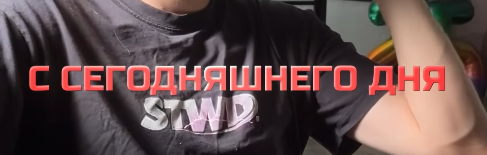
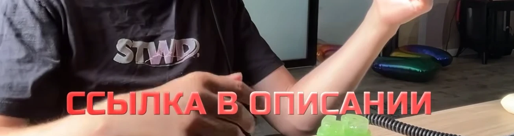

| Параметр | Значение |
|---|---|
| Шрифт | **Russo One Regular** (`assets/fonts/RussoOne-Regular.ttf`) |
| Регистр | ВСЕ ЗАГЛАВНЫЕ |
| Кегль | **80–90 px** в кадре 1080. Ориентир: фраза из 17 знаков («С СЕГОДНЯШНЕГО ДНЯ») занимает около 85 % ширины |
| Трекинг | 0…+20 (в единицах AE) |
| Интерлиньяж, если 2 строки | 100–105 % кегля |
| Выключка | По центру |
| Заливка | Коралово-красный **#FD5E5D** (замерено по скриншоту) |
| Градиент заливки | Сверху вниз **#FF7A74 → #F5474B**. Едва заметный, только чтобы буквы «налились» |
| Фаска (Bevel & Emboss) | Inner Bevel, Smooth, Size 3 px, Soften 1–2 px, Angle 90°, Altitude 30–40°. Свет: белый, Screen, 45 %. Тень: **#C34D4E**, Multiply, 60 % |
| Тень (Drop Shadow) | Чёрная, 65–75 %, Angle 90° (вниз), Distance 4–6 px, Size 10–14 px |
| Внешнее свечение (необязательно) | Чёрное, Normal, 25 %, Size 20 px, чтобы текст читался на светлом фоне |
| Обводка | Нет |

**Собрать в AE:** выдели слой → Layer → Layer Styles → Gradient Overlay, Bevel and Emboss, Drop Shadow с параметрами из таблицы.

### 3.3 Стиль S2 «White Pixel» — разговорный

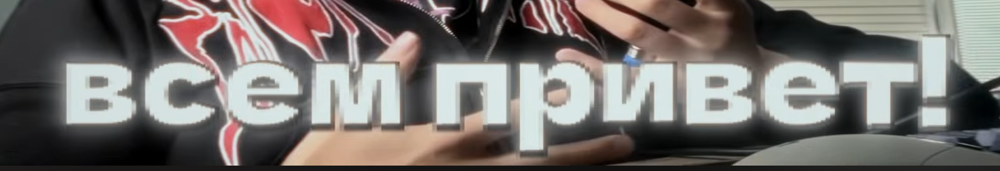
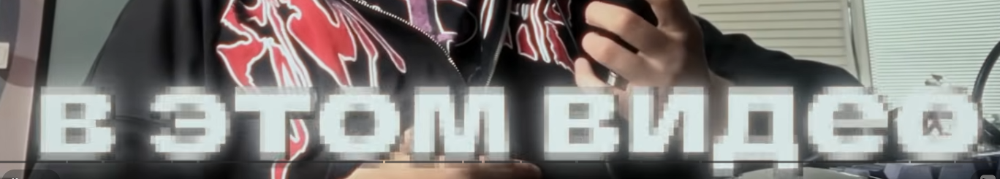

| Параметр | Значение |
|---|---|
| Шрифт | **Широкий жирный гротеск.** Какой именно на скриншоте, не знаю, см. [вопрос 1](#16-открытые-вопросы). Пока заменяем на **Unbounded Black** (Google Fonts, есть кириллица) или Arial Black с горизонтальным масштабом 125 % |
| Регистр | строчные |
| Кегль | **110–130 px**. Ориентир: «всем привет!» (12 знаков) занимает около 88 % ширины |
| Трекинг | −10…0 |
| Заливка | Холодный белый **#E4EEEC** (на скриншоте около #D7E3E1, это уже после сжатия) |
| Пикселизация | Прекомпоз текста → **Effect → Stylize → Mosaic**, блок 5–6 px (Horizontal 180–216, Vertical 320–384 блоков). Sharp Colors выключен: на краях должны получиться серые «ступеньки», как на скриншоте |
| Жёсткая тень (экструзия) | Drop Shadow **#3C3C3C**, 100 %, Angle 135°, Distance 3–4 px, Size 0: тёмный край справа снизу |
| Тёмный ореол | Второй Drop Shadow (или Outer Glow) чёрный, 70–80 %, Distance 0, Size 30–40 px |
| Свечение (bloom) | Effect → Glow (или Deep Glow): Threshold 60 %, Radius 20–30, Intensity 0,3–0,5 |
| Шум | Лёгкий Noise 2–3 % на всём кадре добавляет «видео»-фактуру |

### 3.4 Какой стиль когда

Предлагаю такое деление. Нужно твоё подтверждение, см. [вопрос 3](#16-открытые-вопросы).

| Ситуация | Стиль |
|---|---|
| Обычная речь, приветствие, пояснения, влог | **S2 White Pixel** |
| Хук в первые 2 секунды, главные тезисы, цифры, призыв к действию («ССЫЛКА В ОПИСАНИИ», «ПОДПИШИСЬ») | **S1 Red Russo** |
| Сторителлинг поверх графической вставки (как в C) | **S3 Gold** (ниже) или S1 |
| Внутри одной фразы нужно выделить слово | Слово набираем S1, остальное S2. Технически это два слоя, см. [4.5](#45-субтитры-из-маркеров-один-слой-на-весь-ролик) |

**S3 «Gold» — субтитры для сторителлинга** (из референса C):

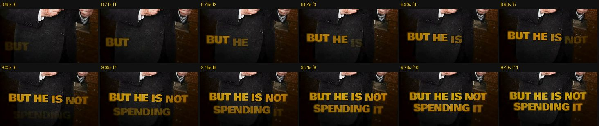

- Russo One или Montserrat Black, ЗАГЛАВНЫЕ, 70–80 px, две строки, по центру, центр блока на y ≈ 1350–1450.
- Градиент сверху вниз: **#E0B21C → #B88E09 → #7A5A0C**. Мягкая тёмная тень 60 %, Size 12 px.
- Слова появляются по одному точно в речь: размытие, прозрачность, подъём на 20 px, 6–8 кадров на слово.

### 3.5 Позиция и размер

- Центр строки субтитров: **y ≈ 1180–1300 px**. Это нижняя треть, но выше интерфейса платформы. Опускать ниже 1440 px нельзя.
- Если в этом месте лицо или важная деталь, поднимай на **y ≈ 700–800**. Держим одну позицию на весь ролик и не прыгаем.
- Ширина строки не больше **880 px** (от 100 до 980).
- На графических вставках, где крупный текст уже есть в композиции, субтитры можно убрать, **только если** на экране дословно то же, что говорит спикер. Иначе субтитры остаются.

### 3.6 Синхронизация с речью

| Правило | Значение |
|---|---|
| Когда появляется слово | За **1–2 кадра** до начала звука слова |
| Самое позднее | В момент звука. Опаздывать нельзя |
| Шаг между словами | По речи. В референсе A слова появляются через 0,07–0,13 с (2–4 кадра) |
| Смена фразы | На паузе дыхания или на склейке |
| Проверка | Смотри на скорости 0,5× с включённым звуком: каждое слово должно «прыгать» на экран вместе с голосом |

**Как получить тайминги слов:**
- **Premiere Pro:** Текст → Транскрибировать → Создать субтитры. Максимум 18 знаков, минимальная длительность 0,3 с, промежуток 0 кадров, одна строка. Исправь ошибки → экспорт SRT.
- **CapCut:** Текст → Автосубтитры (русский) → исправить → экспорт SRT (если нужен AE).
- **Whisper локально** (точные тайминги по словам): `whisper voice.wav --model large-v3 --language ru --word_timestamps True --max_words_per_line 3 --output_format srt`.

---

## 4. Apple-анимация текста — главный приём

### 4.1 Принцип

Так текст появляется в презентациях Apple и на apple.com, и так же в референсах A, B, C и D:

- текст **выплывает из размытия**, одновременно становится видимым и чуть поднимается;
- стартует быстро и **долго, мягко тормозит** (кривая ease-out);
- **никаких отскоков**, пружин, вращений, «печатной машинки» с курсором (кроме отдельного приёма T5);
- элементы появляются **по очереди** со смещением: слова по речи, буквы с шагом 1,5–2 кадра;
- исчезает текст либо вместе со сценой (переходом), либо коротко и незаметно.

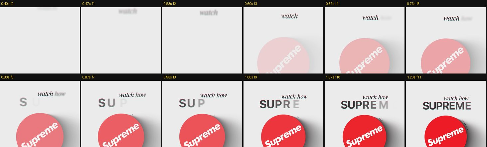
*Референс A, 0,40–1,20 с: «watch» и «how» выплывают по словам, «SUPREME» — по буквам с шагом около 2 кадров. Буква появляется светло-серой и размытой, потом темнеет и становится резкой.*

### 4.2 Тайминги (30 fps)

| Параметр | **Слово** (субтитры, мелкий текст) | **Буква** (крупное ключевое слово) | **Крупное слово целиком** («TRUTH») | **Исчезновение** |
|---|---|---|---|---|
| Длительность одного элемента | **9 кадров** (0,30 с), диапазон 7–12 | **7 кадров** (0,23 с) | **13 кадров** (0,43 с) | **4 кадра** (0,13 с) |
| Задержка между элементами | По речи; при фиксированной — 3 кадра (0,10 с) | **1,5–2 кадра** (0,05–0,066 с) | — | Все сразу |
| Прозрачность | 0 → 100 % | 0 → 100 % | 0 → 100 % за первые 60 % времени | 100 → 0 % |
| Размытие (Blur) | **20 → 0 px** (16–24) | 12 → 0 px | 28 → 0 px | 0 → 10 px |
| Сдвиг по Y | **+36 → 0 px** (≈ 0,4 кегля) | +24 → 0 px | 0 | 0 → −12 px |
| Масштаб | 100 % (можно 96 → 100 %) | 100 % | **110 → 100 %** | 100 % |
| Трекинг (необязательно) | — | — | +40 → 0 | — |
| Цвет | — | Светло-серый → основной (даёт сама прозрачность) | Бледный → насыщенный (#9CC8F0 → #1F6FD0 в B) | — |
| Кривая | **ease-out** (ниже) | ease-out | ease-out | **ease-in** |

### 4.3 Кривые

| Кривая | cubic-bezier | Где |
|---|---|---|
| **Apple ease-out** (основная) | **(0.22, 1, 0.36, 1)**, это easeOutQuint | Всё, что появляется |
| Мягкая ease-out | (0.25, 0.1, 0.25, 1) | Долгие движения камеры и объектов |
| ease-in для исчезновения | (0.55, 0, 1, 0.45) | Исчезновение текста, уход объекта из кадра |
| ease-in-out | (0.65, 0, 0.35, 1) | Наезды и дрейф камеры |

**Настройка в Graph Editor (AE)** для ease-out на двух ключах:
- первый ключ: **Outgoing Influence 5–10 %**, скорость высокая (почти линейный старт);
- второй ключ: **Incoming Influence 85–95 %**, скорость 0.
- Контроль: на графике скорости (Speed Graph) резкий пик в начале и длинный пологий хвост до нуля.

### 4.4 Сборка аниматора в AE (субтитры по словам)

1. Текстовый слой → выбери стиль S1 или S2 из раздела 3.
2. **Animate → Opacity.** Потом в этом же Animator: **Add → Property → Position**, **Blur**, при желании **Scale**.
3. Значения аниматора: **Opacity 0 %, Position 0,36, Blur 20,20**.
4. Удали Range Selector. **Add → Selector → Expression.**
5. В Expression Selector: **Based On → Words** (для букв: Characters Excluding Spaces).
6. В **Amount** вставь выражение из 4.5.
7. **More Options → Anchor Point Grouping: Word.** Grouping Alignment 0, −50 %, чтобы масштаб и поворот работали от центра каждого слова.
8. Включи моушн-блюр слоя.

### 4.5 Субтитры из маркеров: один слой на весь ролик

**Идея:** один текстовый слой, на нём **маркер на каждую фразу**, текст фразы записан в комментарий маркера. Выражения сами подставляют текст и запускают анимацию от каждого маркера. Маркеры ставишь вручную (`*` на цифровой клавиатуре во время воспроизведения, двойной клик по маркеру → вписать фразу) или из SRT скриптом `assets/montage/scripts/srt-to-markers.jsx`. Маркер с комментарием `-` скрывает текст.

**Source Text** (Alt+клик по секундомеру):
```js
// Текст берётся из комментария последнего маркера слоя
var m = thisLayer.marker;
var txt = "";
if (m.numKeys > 0) {
  var n = m.nearestKey(time).index;
  if (m.key(n).time > time) n--;
  if (n > 0) txt = m.key(n).comment;
}
(txt == "-") ? "" : txt;
```

**Animator 1 «Появление» → Expression Selector → Amount:**
```js
// Apple-появление по словам от каждого маркера
var delay = 0.10;   // шаг между словами, с (по речи: 0.07–0.15)
var dur   = 0.30;   // длительность появления слова, с (9 кадров)
var m = thisLayer.marker;
var t0 = inPoint;
if (m.numKeys > 0) {
  var n = m.nearestKey(time).index;
  if (m.key(n).time > time) n--;
  if (n > 0) t0 = m.key(n).time;
}
var t = time - t0 - (textIndex - 1) * delay;
var p = clamp(t / dur, 0, 1);
var e = 1 - Math.pow(1 - p, 5);   // easeOutQuint ≈ cubic-bezier(0.22, 1, 0.36, 1)
100 * (1 - e);
```

**Animator 2 «Исчезновение»** (Opacity 0 %, Blur 10,10, Position 0,−12) → Expression Selector (Based On: Words) → Amount:
```js
// Короткое исчезновение всей фразы перед следующим маркером
var out = 0.13;     // 4 кадра
var m = thisLayer.marker;
var tEnd = outPoint;
if (m.numKeys > 0) {
  var n = m.nearestKey(time).index;
  if (m.key(n).time <= time) n++;
  if (n <= m.numKeys) tEnd = m.key(n).time;
}
var p = clamp((time - (tEnd - out)) / out, 0, 1);
100 * p * p * p;    // ease-in
```

**Два стиля в одном ролике:** сделай два таких слоя, `SUB_white` (S2) и `SUB_red` (S1). Фраза идёт маркером на тот слой, каким стилем её показать. На другом слое в этот момент стоит маркер `-`.

**Точная синхронизация по словам:** если фраза длинная и темп речи неровный, поставь фразу отдельным слоем и замени `(textIndex - 1) * delay` на время маркера каждого слова (маркер на слово, `m.key(textIndex).time`).

### 4.6 Варианты

| Вариант | Based On | Где |
|---|---|---|
| **По словам** | Words | Субтитры, мелкий курсивный текст |
| **По буквам** | Characters Excluding Spaces, delay 0,05–0,066 | Крупное ключевое слово (SUPREME, TRIBE) |
| **Строкой** | Lines, delay 0,15 | Абзац мелкого текста под объектом |
| **Целиком со «вставанием»** | Одно слово, Scale 110 → 100 % | Одно огромное слово (TRUTH) |

### 4.7 Premiere Pro и CapCut

- **Premiere Pro:** встроенные субтитры так не анимируются. Варианты: (а) сделать MOGRT в AE с аниматором из 4.4 и выводом текста в Essential Graphics; (б) собрать субтитры в AE и вставить в Premiere через Dynamic Link.
- **CapCut:** автосубтитры → стиль (шрифт, цвет, тень по разделу 3) → Анимация → «Вход»: пресет с размытием или плавным проявлением, **0,3 с**. Если есть анимация «по словам», выбирай её. Отскоки и «прыжки» не используем.

### 4.8 Частые ошибки

- ❌ Отскок и пружина (overshoot): это уже не Apple, выглядит дёшево.
- ❌ Появление дольше 0,5 с: текст отстаёт от речи.
- ❌ Линейная кривая: движение «деревянное».
- ❌ Все слова фразы появляются одновременно без смещения: теряется «волна».
- ❌ Размытие без сдвига или сдвиг без размытия: нужны оба.
- ❌ Субтитры скачут по высоте от фразы к фразе.

---

## 5. Библиотека анимаций текста из референсов

Всё ниже — варианты базовой Apple-анимации из раздела 4. Тайминги для 30 fps.

### T1. Мелкий курсив по словам → крупное слово по буквам (A)

- Сначала мелкая строка курсивом появляется по словам, в темп речи. Через 3–5 кадров крупное ключевое слово появляется по буквам.
- Буквы появляются светло-серыми и размытыми, за 7 кадров становятся резкими и тёмными. Шаг 2 кадра.
- Весь блок текста всё время чуть дрейфует вместе с камерой.

### T2. «Кувырок» букв (A: RED LOGO, BRAND)
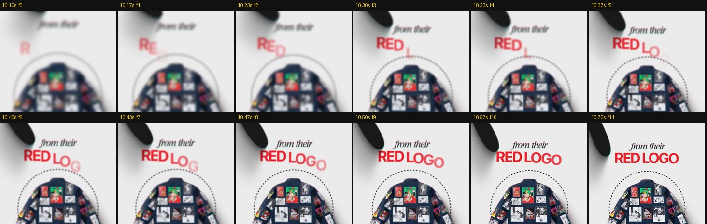
- Буквы влетают снизу с поворотом: Position 0,+40, **Rotation 20–25°**, Opacity 0, Blur 12 → всё в 0. По символам, шаг 2 кадра, 8 кадров на букву.
- Разнобой углов даёт второй селектор: **Wiggly Selector**, Mode: Intersect, Wiggles/Second 0, Based On: Characters.
- Цвет акцентный: красный **#DE242F** для бренда или **#3A3936** для графитового.
- Используем для 1–2 ключевых слов за ролик, не чаще.

### T3. Крупное слово «встаёт» из размытия (B: TRUTH)
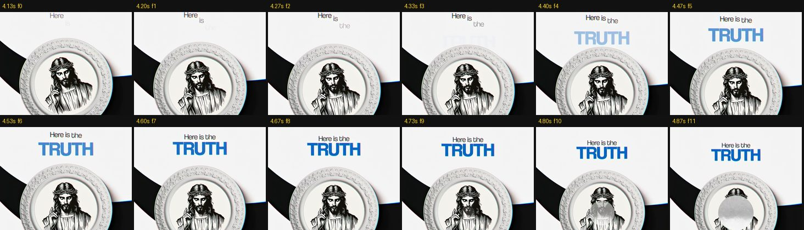
- Слово целиком: Scale 110 → 100 %, Blur 28 → 0, Opacity 0 → 100 %, 13 кадров.
- Цвет «наливается»: бледный → насыщенный (Fill Color в аниматоре или Tint).
- Над ним мелкая строка «Here is the» появляется по словам, на 4–6 кадров раньше.

### T4. Золотые слова внизу (C) — см. S3 в разделе 3.4

### T5. Курсор и рамка выделения, как в Figma (B)
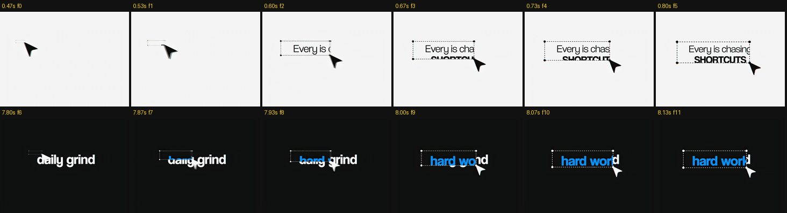
- Курсор (чёрная стрелка на светлом фоне, белая на тёмном) въезжает за 6–8 кадров с ease-out.
- Курсор протягивается по диагонали, и за ним растягивается **рамка выделения**: пунктир 1,5 px (штрих 4, пробел 4), по углам квадратные маркеры 8×8 px с белой заливкой и тёмной обводкой.
- Текст внутри проявляется по буквам **вместе с ростом рамки** (Range Selector привязан к ширине рамки).
- **Замена слова:** курсор выделяет старое слово («daily grind»), и оно меняется на новое («hard work») ярко-синего цвета **#1F9CF7** за 4–6 кадров.
- 🔥 **Для твоих AE-туториалов это самый полезный приём:** им удобно выделять названия параметров, эффектов и плагинов.

### T6. Текст по дуге вокруг объекта (B: «no magic pill»)
- Текст на круговом пути (Path Options → Path), радиус = радиус объекта + 50–70 px, дуга над объектом.
- Появление по символам слева направо, 0,6 с на всю фразу. Цвет каждой буквы идёт от тёмно-красного **#6E2020** к белому или светло-розовому.

### T7. «Стопка» крупных слов (C: THEN THE WHOLE COUNTRY OF GREECE)
- По одному слову на строку, крупные жирные ЗАГЛАВНЫЕ, строки вплотную (интерлиньяж 90–95 %).
- Каждое слово появляется **в момент произнесения**: Scale 115 → 100 %, Blur 10 → 0, 4–6 кадров.
- Заливка с текстурой (бетон, бумага) через Track Matte, лёгкая внутренняя тень. Блок стоит в «рамке» из реальных предметов (ручки, линейки).

### T8. Рукописная надпись (C: «Billion Dollars»)
- Рукописный шрифт (с кириллицей: **Caveat** или **Marck Script**), жёлтый **#E5C33A**.
- Появляется «написанием»: маска + Stroke или Trim Paths по контуру, 0,6–0,8 с, стартует на слово в речи.

### T9. Счётчик-наклейки (C: 300 → 381)
- Цифры на бумажных наклейках: белая карточка с чёрными цифрами или красная **#E03A48** с белыми.
- Новая наклейка «шлёпается» поверх старой: Scale 125 → 100 % за 2–3 кадра, поворот −8…+6°, тень. Старые цифры частично видны под новой.
- Используем для любых цифр: цена, просмотры, подписчики, «было → стало».

### T10. Текст, открытый лучом света (D: «not only his space»)
- Текст лежит в темноте и виден **только внутри светового конуса** (Track Matte на форму луча).
- Луч вращается от объекта, 1–1,5 с, ease-in-out. Текст «проявляется светом».

---

## 6. Кинетическая типографика: надписи в графике

### 6.1 Пары шрифтов (все с кириллицей)

| Роль | Основной | Запасной | Как выглядит |
|---|---|---|---|
| **Крупное ключевое слово** | **Russo One** | Montserrat Bold/ExtraBold, Inter Tight Bold | ЗАГЛАВНЫЕ, 90–140 px |
| **Мелкий курсив-«шёпот»** | **Playfair Display Italic** | Cormorant Garamond Italic, PT Serif Italic | строчные, 34–44 px |
| **Абзац-«декор»** под объектом | Inter Regular | Montserrat Regular | 18–22 px, серый #6B6B6B, 3–4 строки по центру |
| **Рукописный акцент** | Caveat Bold | Marck Script | 1–2 раза за ролик |

> Russo One — техно-спортивный шрифт, у него есть характер. Референсы сделаны на более нейтральном гротеске. Если в графике Russo One покажется слишком «игровым», крупные слова в графике набирай Montserrat Bold, а Russo One оставь для субтитров S1.

### 6.2 Компоновка «шёпот + крик»

```
         с сегодняшнего            ← курсив, 38 px, #3A3936, чуть правее левого края слова
     ВСЁ  ИНАЧЕ                    ← жирный, 120 px, графит #3A3936 или акцент
```
- Курсив стоит **над крупным словом** и чуть заходит на его левую часть. Расстояние между строками 0–8 px, почти впритык.
- Иногда курсив стоит **под** объектом, а крупное слово ещё ниже (A: *went from being a small* **SKATESHOP**).
- Курсивом пишем служебные слова и связки, крупным — одно-два смысловых слова.
- Ещё не появившиеся слова курсива можно показывать бледно-серыми (**#B5B5B5**), тогда предложение «наливается» по мере речи.

### 6.3 Типовая раскладка кадра (из A)

| Зона | y (px) | Что стоит |
|---|---|---|
| Верхний текстовый блок | **450–650** | Курсив + крупное слово |
| Главный объект | центр **≈ 950** | Фото, 3D-объект, мокап телефона |
| Нижний текстовый блок | **1350–1480** | Курсив + крупное слово или абзац-декор |
| Субтитры (если их нет в графике) | **1180–1300** | S1/S2 |

---

## 7. Визуальный язык сцен

### 7.1 Четыре «мира» референсов

| | **A — «Редакционный светлый»** | **B — «Чёрно-белый контраст»** | **C — «Бумажный коллаж»** | **D — «Полутон и тени»** |
|---|---|---|---|---|
| Фон | Ровный **#EBEBEB** | **#F4F4F4** ↔ **#101010**, резкие смены | Реальные предметы сверху (стол, бумага, деньги), сильная виньетка | Бетон или бумага, серый **#6E6E6E** в центре → **#4F4F4F** по углам, потом почти чёрный |
| Объекты | Ч/б фото в карточках со скруглением 24–32 px или в мокапе iPhone с тонким розовым ободком; вырезанные предметы; 3D-персонаж на красном постаменте | 3D-таблетки (красная, синяя, белая), печать-медальон | Вырезанный человек с белой обводкой-«наклейкой», гипно-мишень | Мозг, глаз (реалистичные, ч/б), разрезанное фото |
| Акцентный цвет | Красный **#DE242F**, бледно-розовые ленты **~#F2C6CC** | Синий **#1F9CF7**, красный таблеток | Красный, золото **#C8A215** | Нет, только серый |
| Графика | Пунктирные круги вокруг объекта (штрих 2–3 px, #333, пунктир 6/6, рисуются через Trim Paths); тонкая сетка и крестики-метки под объектом; широкие изогнутые ленты за объектом | Точечная сетка под объектом; чёрные «пропеллеры» с хроматической аберрацией на краях | Бумажные текстуры, марки, монеты | Тонкие линии, соединяющие объекты; световые круги и конусы; разметка поля |
| Глубина | **Чёрные «лепестки» по углам кадра**, сильно размытые (Camera Lens Blur 30–60), медленно вращаются | Те же формы, резкие, с цветной каймой | Виньетка, тени предметов | Мягкий свет сверху, растр |

### 7.2 Общие правила

- **Один главный объект в центре.** Вокруг пусто: 40–60 % кадра остаётся фоном.
- **Тень у каждого объекта:** Drop Shadow чёрная, **25–35 %**, Angle 135° (вправо вниз), Distance 25–60 px, Softness 60–120 px. Тень длинная и мягкая, как от студийного софтбокса.
- **Фото ч/б:** Hue/Saturation → Saturation −100, Curves с лёгким S-контрастом. Цветным оставляем только акцент (красный логотип и т. п.).
- **Хроматическая аберрация** на контрастных краях: 2–3 px, красный и голубой (эффект Channel Offset или плагин). Не на всём кадре, а на тёмных формах и крупных объектах.
- **Текстура на всём кадре:** Noise 2–4 % или полутоновый растр (Color Halftone) 10–20 % в режиме Overlay. В D это прямо подписано на обложке: «Shadows» и «Halftone texture».
- **Виньетка** в тёмных и коллажных сценах: 20–40 %.

### 7.3 Палитра (всё в одном месте)

| Имя | HEX | Где |
|---|---|---|
| Фон светлый | `#EBEBEB` | A |
| Фон белый | `#F4F4F4` | B |
| Фон тёмный | `#101010` | B, заставки |
| Графит (текст) | `#3A3936` | Крупные слова на светлом фоне |
| Серый бледный | `#B5B5B5` | Ещё не появившиеся слова, линии |
| Красный бренд | `#DE242F` | Акцентное слово, логотипы |
| Коралл субтитров S1 | `#FD5E5D` | Субтитры S1 |
| Тень коралла | `#C34D4E` | Фаска S1 |
| Синий акцент | `#1F9CF7` | Выделения, T5 |
| Синий глубокий | `#0B5CAD` | Крупное слово в стиле T3 |
| Золото | `#C8A215` → `#B88E09` → `#7A5A0C` | Субтитры S3 |
| Холодный белый | `#E4EEEC` | Субтитры S2 |
| Розовая лента | `~#F2C6CC` | Фоновые ленты A |

---

## 8. Камера и движение

| Приём | Параметры | Где в референсах |
|---|---|---|
| **Постоянный медленный наезд** | Scale 100 → 104 % за 3 с, ease-in-out. В каждой сцене | A, B, D |
| **Дрейф** | Position ±15–30 px за сцену, или `wiggle(0.4, 8)` на нуле-камере | A: весь блок текста и объект плывут |
| **Параллакс** | Передний план (лепестки) двигается в 1,5–2 раза быстрее объекта, фон в 0,5 раза | A, B |
| **Поворот камеры** | Rotation 0 → 15–20° за 2 с, ease-in-out | D: сцена с глазом |
| **Отъезд с раскрытием** | Scale 100 → 45 % за 3–4 с: из крупного плана открывается общая картина (мозг → футбольное поле) | D, 9,5–13 с |
| **Фокус «вытягивается»** | Сцена начинается размытой (Blur 20 → 0 за 8–10 кадров), как будто объектив наводится | A: сцены с деньгами и курткой |

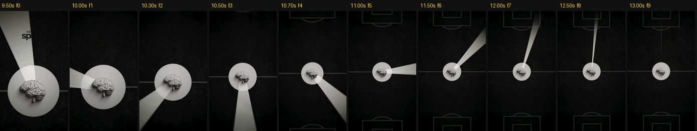

**Правило:** в кадре нет ни одной полностью статичной секунды. Если сцена длиннее 1 с, в ней обязательно что-то двигается.

---

## 9. Переходы

Каждый переход сопровождается звуком (свуш, хит). Пик звука приходится на кадр склейки.

### TR1. Жёсткая склейка в бит (по умолчанию)
- Используется чаще всего. Склейка на удар или сильную долю.
- В B две склейки из трёх попадают в удар с точностью до 1 кадра (0,001 и 0,008 с от удара).

### TR2. Вертикальный рывок с моушн-блюром (A)
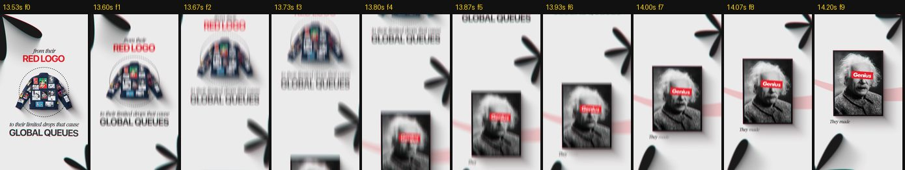
- Сцена уезжает вверх, новая приходит снизу. Сильный вертикальный моушн-блюр (Directional Blur 90°, 60–120 px на пике).
- **8–10 кадров**, ease-in-out, пик скорости на склейке.

### TR3. Расфокус (A)
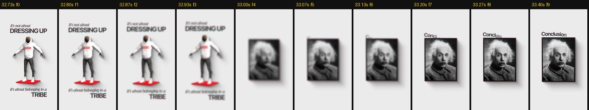
- Старая сцена: Blur 0 → 40 и Scale 100 → 96 % за **6 кадров** (ease-in). Склейка. Новая сцена: Blur 40 → 0 за **8 кадров** (ease-out).
- Самый «дорогой» и спокойный переход, подходит для смены темы.

### TR4. Объект закрывает кадр (A: купюры)
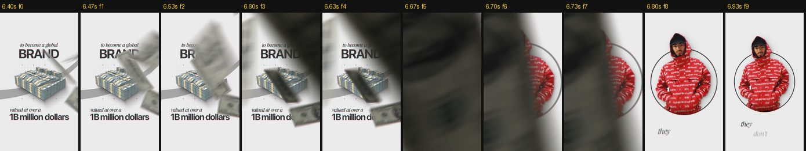
- Предмет из сцены (купюры, бумага, рука) летит в камеру и закрывает весь кадр на 1–2 кадра. Под ним склейка.
- **6–8 кадров** всего. Предмет размыт (близко к камере), с моушн-блюром.

### TR5. Влёт в объект и круговая шторка (B)
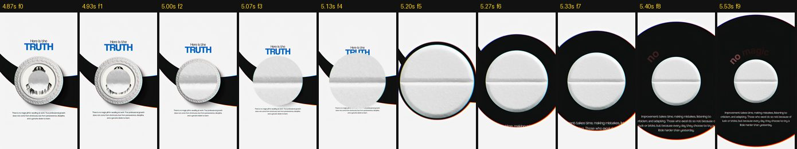
- Камера наезжает на круглый объект, пока он не заполнит кадр. Объект подменяется похожим (печать → таблетка). Затем вокруг него раскрывается **чёрный круг**, и фон меняется со светлого на тёмный.
- **12–14 кадров.**

### TR6. Пролёт объекта через кадр (B: синяя таблетка)
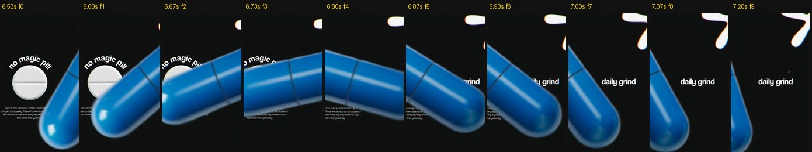
- Крупный размытый объект пролетает по диагонали, за ним уже новая сцена (работает как маска).
- **10–12 кадров.**

### TR7. Разрез фото (D)
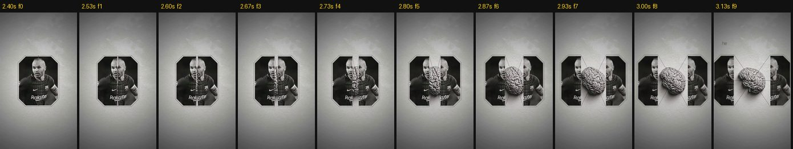
- Фото разрезается по вертикали, половины разъезжаются, из щели выезжает новый объект (мозг).
- **15–18 кадров.** Половины остаются по краям как рамка.

### TR8. Склейка по форме (D: глаз → световой круг)
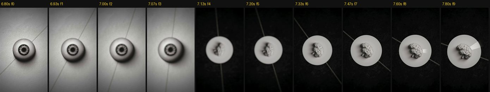
- Круглый объект в конце сцены встаёт ровно на место круглого объекта следующей сцены (глаз → круг света, печать → таблетка).
- Жёсткая склейка, но из-за совпадения формы глаз её «не видит».

### TR9. Быстрый фото-монтаж (A: 25–27 с)
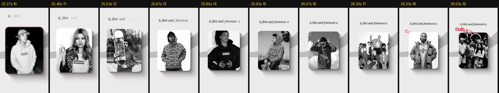
- Фото в одной и той же карточке меняются каждые **3–5 кадров** (0,1–0,17 с), около 16 фото за 2,4 с. Карточка стоит на месте, текст над ней продолжает появляться по словам.
- Используй для перечислений: «рэперы, клипы, бренды…», «вот 20 моих работ».

### Когда какой переход

| Ситуация | Переход |
|---|---|
| Внутри одной мысли, в бит | TR1 |
| Новая мысль, энергичный ритм | TR2, TR6 |
| Смена темы, пауза | TR3 |
| Есть подходящий предмет в кадре | TR4, TR8 |
| Светлая сцена → тёмная | TR5 |
| «Под капотом», разбор | TR7 |
| Перечисление | TR9 |

---

## 10. Ритм и тайминг

| Метрика | Референсы | Правило для нас |
|---|---|---|
| Длина сцены (между переходами) | A: 3–6 с; B: 1–2 с (последняя 3,7 с); C: 1–3,5 с; D: 2–5 с | **1,5–5 с**, в среднем около 3 с |
| Как часто в кадре что-то новое | Каждые 0,3–1 с | **Не реже раза в секунду** |
| Первый контент | A: 0,37 с чёрного, D: 0,33 с обложки | **Движение с первого кадра**, чёрный в начале не нужен. Обложка на 5–10 кадров допустима |
| Быстрый монтаж | 3–5 кадров на фото | Только для перечислений |
| Финальная удержка | B: 3,7 с на последней фразе, потом петля | 1–2 с на последнем смысловом кадре |
| Концовка | A: заставка студии 2,8 с на **#111**; B: бесшовная петля | Петля **или** короткая фирменная заставка (у тебя это 🐸, см. `shorts-plan.md`) |

**Петля (как в B):** последний кадр по композиции и звуку совпадает с первым. Зритель не замечает конца, ролик досматривают повторно, и это продвигает его в алгоритме.

---

## 11. Звук

По спектрограммам и замерам громкости: во всех референсах есть **музыкальная подложка** с тянущейся тональной нотой и частыми перкуссионными щелчками. В C и D отчётливо слышен закадровый голос. На переходах звучат свуши.

| Параметр | Референсы | Правило |
|---|---|---|
| Громкость (LUFS) | A −18,4; B −22,6; C −13,8; D −18,7 | **−14 LUFS**, пик −1 dBTP |
| Голос | — | Пики −6…−3 dBFS, компрессия 3:1, де-эссер, лёгкий EQ (срез до 80 Гц) |
| Музыка под голосом | — | На **18–22 дБ** тише голоса (ducking), в паузах поднимается |
| Склейки | B: 2 из 3 склеек точно в удар | Склейка = удар (±1 кадр) |
| Звуки (SFX) | — | Свуш на каждый переход (пик на склейке); мягкий «тик» или «поп» на крупные слова (T1–T3, T9); клик мыши на T5; шорох бумаги на коллаже; райзер 0,5–1 с перед главным раскрытием |
| Субтитры | — | **Не озвучиваем каждое слово**, иначе будет каша. Звук только на ключевые слова |

---

## 12. Как применить стиль к своему контенту

Твой формат (см. `shorts-plan.md`): **влог + экспертность**. Ты в кадре, запись экрана After Effects и одна польза на ролик. В референсах нет говорящей головы, поэтому стиль переносим так:

| Тип кадра | Что делаем |
|---|---|
| **Ты в кадре** | Ч/б или приглушённый цвет (Saturation −30…−100), лёгкий наезд 100 → 104 %, субтитры S2 на речь и S1 на тезисы. На каждой второй склейке «пуш-ин» 100 → 110 %, чтобы убрать «прыжки» от вырезанных пауз |
| **Экран AE** | Кроп на нужную панель, плавный наезд на параметр. **T5** (курсор и рамка) на название эффекта или параметра. Субтитры не прячем |
| **Графическая вставка** (2–5 с) | Мир A или D: светлый или бетонный фон, один объект (скрин эффекта, иконка плагина, кадр клипа в карточке), пара «шёпот + крик» из раздела 6.2 |
| **Цифры** | T9 (наклейки) или T3 |
| **До и после** | Разрез TR7 или две карточки рядом |

### 12.1 Шаблон ролика на 35 секунд

| Время | Видео | Текст / субтитры | Анимация и переходы | Звук |
|---|---|---|---|---|
| 0,0–0,3 | Обложка: объект + крупное слово | S1, 1–2 слова | — | Удар |
| 0,3–2,5 | **Хук:** ты крупно, наезд | S1: тезис хука | Apple по буквам на главное слово (T1) | Музыка стартует, хит на ключевое слово |
| 2,5–6 | Вставка: результат эффекта | S2 на речь | TR2 → вставка, T3 на название | Свуш |
| 6–25 | Экран AE, 3 шага по 5–6 с, между ними ты | S2 на речь, S1 на «шаг 1/2/3» | T5 на параметры, TR1 в бит, TR3 между шагами | Клики, свуши |
| 25–30 | До и после | S1: «БЫЛО → СТАЛО» | TR7 или TR9 | Райзер → удар |
| 30–35 | Ты в кадре, CTA | S1: «ПОДПИШИСЬ — …» | Apple по словам | Музыка поднимается |
| 35+ | Петля на начало или 🐸-заставка 1 с | — | TR3 или жёсткая склейка на первый кадр | — |

---

## 13. Порядок работы

1. **Сценарий.** Размечаешь, какие слова уйдут в графику (крупно), какие в субтитры S1, а что остаётся обычной речью S2.
2. **Черновой монтаж** (Premiere или CapCut): вырезаешь паузы и дубли, собираешь «скелет» под музыку, склейки в бит.
3. **Звук сначала:** голос почищен, музыка подобрана, склейки стоят в ударах. Дальше вся графика подстраивается под звук.
4. **Транскрибация** → SRT, по 1–3 слова на фразу (раздел 3.6). Проверить каждое слово.
5. **After Effects:** импорт звука и черновика → слои `SUB_white` и `SUB_red` → маркеры из SRT скриптом → выражения из 4.5 → стили из раздела 3.
6. **Графические вставки** по разделам 5–7.
7. **Переходы** по разделу 9, к каждому свуш.
8. **Финиш:** текстура (шум или растр), виньетка, хроматическая аберрация на акцентах, общая цветокоррекция.
9. **Проверка** по чек-листу (раздел 14) → экспорт (раздел 2).

---

## 14. Чек-лист перед экспортом

**Субтитры**
- [ ] Каждое слово спикера есть на экране, текст проверен на слух
- [ ] Слова появляются в речь, без опозданий (проверено на 0,5×)
- [ ] 1–3 слова на экране, не больше 18 знаков в строке
- [ ] Высота субтитров одинаковая во всём ролике, в безопасной зоне
- [ ] S1 только на тезисах и CTA, S2 на обычной речи

**Анимация**
- [ ] Всё появляется через Apple ease-out: размытие + прозрачность + подъём, без отскоков
- [ ] Нет статичных кадров дольше 1 с
- [ ] Моушн-блюр включён

**Картинка**
- [ ] Один главный объект в сцене, у объектов мягкие тени
- [ ] Один акцентный цвет на сцену
- [ ] Не больше трёх шрифтов
- [ ] Текстура и шум на всём кадре
- [ ] Ничего важного в зонах интерфейса

**Звук**
- [ ] −14 LUFS, пик −1 dBTP
- [ ] Свуш на каждом переходе, склейки в ударах
- [ ] Музыка приглушена под голосом

**Концовка**
- [ ] Петля или фирменная заставка
- [ ] Первые 5–10 кадров годятся в обложку

---

## 15. Спецификация для ИИ и монтажёра (YAML)

```yaml
style_guide: young-yanny-montage-v1
canvas: { width: 1080, height: 1920, fps: 30, safe_zone: { x: [70, 950], y: [220, 1480] } }

subtitles:
  required: true                 # субтитры на ВСЮ речь спикера, всегда
  words_per_screen: [1, 3]
  max_chars_per_line: 18
  lead_frames: 2                 # слово появляется за 1–2 кадра до звука
  hide_on_pause_over_s: 0.7
  position_center_y: [1180, 1300]
  styles:
    S1_red_russo:                # тезисы, хук, CTA
      font: "Russo One Regular"
      case: upper
      size_px: [80, 90]
      tracking: [0, 20]
      fill: "#FD5E5D"
      fill_gradient: ["#FF7A74", "#F5474B"]   # сверху вниз
      bevel: { size_px: 3, highlight: "#FFFFFF@45%", shadow: "#C34D4E@60%" }
      drop_shadow: { color: "#000000", opacity: 0.7, angle: 90, distance_px: 5, size_px: 12 }
    S2_white_pixel:              # обычная речь
      font: "TBD — широкий Black-гротеск (временно Unbounded Black)"
      case: lower
      size_px: [110, 130]
      fill: "#E4EEEC"
      mosaic_block_px: 6
      hard_shadow: { color: "#3C3C3C", angle: 135, distance_px: 3 }
      soft_halo: { color: "#000000", opacity: 0.75, size_px: 35 }
      glow: { threshold: 0.6, radius: 25, intensity: 0.4 }
    S3_gold:                     # сторителлинг на графике
      font: "Russo One | Montserrat Black"
      case: upper
      size_px: [70, 80]
      fill_gradient: ["#E0B21C", "#B88E09", "#7A5A0C"]

text_animation_apple:
  easing_in: "cubic-bezier(0.22, 1, 0.36, 1)"
  easing_out: "cubic-bezier(0.55, 0, 1, 0.45)"
  word:   { frames: 9,  stagger: "по речи (≈3 кадра)", opacity: [0, 100], blur_px: [20, 0], y_px: [36, 0] }
  letter: { frames: 7,  stagger_frames: 2, opacity: [0, 100], blur_px: [12, 0], y_px: [24, 0] }
  hero_word: { frames: 13, scale: [110, 100], blur_px: [28, 0] }
  exit:   { frames: 4, opacity: [100, 0], blur_px: [0, 10], y_px: [0, -12] }
  forbidden: [overshoot, bounce, spring, linear_easing]

typography:
  hero: "Russo One (или Montserrat Bold в графике)"
  whisper: "Playfair Display Italic"
  body: "Inter Regular 18–22px #6B6B6B"
  script: "Caveat Bold"
  max_fonts_per_video: 3

look:
  backgrounds: ["#EBEBEB", "#F4F4F4", "#101010", "бетон/бумага + полутон"]
  photos: grayscale
  one_accent_per_scene: ["#DE242F", "#1F9CF7", "#C8A215"]
  shadows: { opacity: [0.25, 0.35], angle: 135, distance_px: [25, 60], softness_px: [60, 120] }
  texture: { noise_pct: [2, 4], halftone_overlay_pct: [10, 20] }
  chromatic_aberration_px: [2, 3]
  foreground_depth: "размытые тёмные формы по углам"

camera:
  push_in: { scale: [100, 104], seconds: 3, easing: in_out }
  never_static_over_s: 1.0

transitions: [hard_cut_on_beat, whip_vertical_8f, defocus_6f_8f, foreground_occluder_6f, zoom_through_circle_wipe_12f, object_pass_through_10f, split_reveal_16f, shape_match_cut, fast_photo_montage_3to5f]

rhythm: { scene_s: [1.5, 5], new_event_every_s: 1.0 }
audio: { lufs: -14, true_peak_dbtp: -1, music_under_voice_db: [-22, -18], sfx: [whoosh_on_every_transition, pop_on_hero_words, click_on_cursor] }
ending: [seamless_loop, brand_outro_1s]
```

---

## 16. Открытые вопросы

Ответь, и я обновлю гайд. Можно просто прислать файлы.

1. **Шрифт белых пиксельных субтитров** («всем привет!», «в этом видео»). Ты написал «шрифты», а приложен один Russo One. Пришли второй `.ttf/.otf` или название.
2. **Где рисуешь субтитры:** After Effects, Premiere Pro или CapCut? Рецепты расписаны для AE, для остальных дал упрощённые. Могу расписать подробно под твою программу.
3. **Два стиля субтитров:** правильно ли, что белый пиксельный идёт на обычную речь, а красный Russo One — на тезисы и CTA? Или хочешь один стиль на весь ролик?
4. **Позиция субтитров:** на скриншотах кадр обрезан, и я не вижу, где текст стоит по высоте. Пришли полный кадр (1080×1920) из ролика с этими субтитрами.
5. **Четыре видео-референса** — это стиль для **всего ролика** (сплошная моушн-графика, как у Vane Motion) или для **вставок** между кусками, где ты в кадре? Гайд сейчас написан под второй вариант.
6. **Исходники со звуком:** если пришлёшь свой ролик с голосом, распишу тайминги субтитров на живом примере.
7. **Фирменная концовка:** петля или заставка с 🐸? Если заставка, пришли лого или опиши её.

---

*Раскадровки в `assets/montage/refs/` — кадры из референсов (A: Vane Motion, B–D: авторы неизвестны). Они лежат здесь только как образцы для разбора стиля.*
