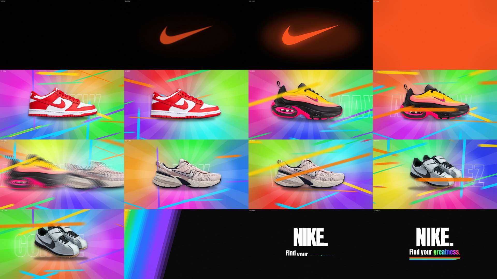

# NIKE — «Find your greatness.» · 10-секундный луп для After Effects

Рекламный ролик 1920×1080, 30 fps, ровно 10 секунд. Первый и последний кадры чёрные, поэтому видео крутится по кругу без шва.



Превью-анимация: [`preview/nike_loop_preview.mp4`](preview/nike_loop_preview.mp4). Её рендерит скрипт на Python по тем же таймингам, что и AE-проект; шрифт в превью — Anton, так как Futura здесь недоступна.

## Как собрать проект в After Effects

1. Откройте After Effects (CC 2018 или новее). Лучше в новом пустом проекте.
2. `File → Scripts → Run Script File…` → `nike_loop/build_nike_loop.jsx`.
   Папка `assets/` должна лежать рядом со скриптом. Если её нет, скрипт попросит указать её вручную.
3. Через несколько секунд откроется композиция `NIKE_LOOP_MAIN`. Все настройки собраны на слое **CONTROLS** (панель Effect Controls).

> Если скрипт ругается на права: `Edit → Preferences → Scripting & Expressions → Allow Scripts to Write Files and Access Network`.

## Раскадровка

| Время | Что происходит |
|---|---|
| 0.00–1.50 | Темнота. Оранжевый свуш проступает из черноты: расфокус → резкость, мягкое свечение, световой блик пробегает по логотипу |
| 1.50–1.95 | Камера «пролетает» сквозь толстую часть свуша, экран заливается оранжевым |
| 1.95 | Вспышка и взрыв радужных лучей с ударной волной: начинается радужный мир |
| 1.90–7.75 | 4 кроссовка сменяют друг друга каждые 1.4 с: влетают справа с овершутом, парят, улетают влево. Вокруг летят радужные полосы со всех сторон, фон переливается, вращаются лучи |
| 7.45–8.10 | Радужная шторка справа налево, последняя полоса чёрная |
| 7.95–8.25 | Удар: «NIKE.» влетает с масштаба 185 % и размытия, кадр вздрагивает |
| 8.20–8.75 | «Find your greatness.» выезжает по словам из щели. Слово «greatness.» залито живой радугой |
| 8.62–9.00 | Радужное подчёркивание из 6 полос |
| 9.25–9.93 | Всё уходит в затемнение. Кадры 9.93–10.00 чёрные, дальше луп |

## Единый стиль кроссовок

Исходники были разными: серый фон с водяным знаком, голубой фон, белый фон, у Air Max всего ~340 px. Чтобы кроссовки не выбивались, их подготовили одинаково (`tools/prepare_assets.py`):

- фон вырезан нейросетью **BiRefNet**, края очищены от цвета старого фона;
- Air Max увеличен в 4 раза нейросетью **Real-ESRGAN**;
- все носки смотрят вправо (Air Max и Cortez отзеркалены);
- одинаковый холст **1600×1000**, одна линия пола (y = 900), одинаковый вписанный размер;
- общая цветокоррекция: уровни, мягкая S-кривая, +14 % насыщенности.

В AE у всех четырёх одинаковое оформление: белое свечение-ореол позади, контактная тень, Drop Shadow, одна и та же анимация влёта и парения, один масштаб (контроллер `Sneaker Scale`).

## Структура проекта

```
NIKE_LOOP/
  NIKE_LOOP_MAIN        главная композиция
  Precomps/
    01_INTRO            свуш, блик, пролёт камеры, лучи и ударная волна
    02_STRIPES_BACK     28 полос позади кроссовок (30 с, зацикливаются через loopOut)
    03_SNEAKERS         S1…S4: _MOVE (null с анимацией) → _SHOE, _SHADOW, _HALO + контурные надписи _WORD
    05_STRIPES_FRONT    6 крупных полос перед кроссовками (с размытием, как вне фокуса)
    04_ENDCARD          радужная шторка, NIKE., подчёркивание
    04b_TAGLINE         слова слогана + радужная заливка «greatness.» (alpha matte)
  Assets/               4 PNG
```

Слои главной композиции сверху вниз: `CONTROLS`, `CAM_SHAKE`, `FX_VIGNETTE`, `FX_GRAIN`, `FADE_TO_BLACK`, `FX_FLASH`, `04_ENDCARD`, `01_INTRO`, `05_STRIPES_FRONT`, `03_SNEAKERS`, `02_STRIPES_BACK`, `BG_SUNBURST`, `BG_RAINBOW`, `BG_BLACK`.
На слое CONTROLS стоят маркеры секций: INTRO, FLY THROUGH, SNEAKER 1–4, END CARD, FADE.

## Контроллеры (слой CONTROLS)

| Контроллер | По умолчанию | Что делает |
|---|---|---|
| Stripe Speed | 1 | скорость всех полос (через time remap прекомпов) |
| Stripe Opacity | 100 | прозрачность полос |
| Rainbow Speed | 90 | скорость переливания радуги, °/с |
| Rainbow Saturation | 92 | насыщенность фона и заливки «greatness.» |
| Shake Amount | 9 | тряска камеры и удары на сменах кроссовок, px |
| Flash Intensity | 100 | сила вспышек на склейках |
| Sneaker Scale | 72 | размер кроссовок, % |
| Sneaker Float | 12 | амплитуда парения, px |
| Shadow Opacity | 45 | контактная тень под кроссовками |
| Grain Amount | 5 | плёночное зерно |
| Vignette | 55 | виньетка |
| Swoosh Color | #F5511E | цвет свуша (как в брифе) |

Всё остальное — обычные ключи с easing на слоях, их можно двигать и править как угодно.

## Частые правки

- **Заменить кроссовок:** выделите PNG в `Assets`, затем `Replace Footage`. Лучше прогнать новую картинку через `tools/prepare_assets.py`, чтобы холст и линия пола совпали.
- **Надписи за кроссовками (DUNK, AIR MAX, V2K, CORTEZ)** — обычные текстовые слои `S1_WORD…S4_WORD` в `03_SNEAKERS`. Их можно переписать или выключить.
- **Шрифт.** Скрипт берёт первый установленный из списка: Futura Condensed ExtraBold (есть в macOS; на Windows — Futura PT Cond Extra Bold из Adobe Fonts) → Anton → Oswald → Impact → Arial Bold. Использованный шрифт показан в итоговом окне.
- **Тайминги** задаются блоком `T` в начале `build_nike_loop.jsx`: поменяйте числа и пересоберите. Цвета — `PALETTE`, полосы — `STRIPES` (количество, длина, толщина, скорость, `seed`).
- **Вертикаль 1080×1920:** поменяйте `width` и `height` в `CFG`. Раскладка считается от размеров кадра.

## Экспорт лупа

`Composition → Add to Render Queue` (или Adobe Media Encoder): H.264, 1920×1080, 30 fps, рабочая область 0–10 с. Для соцсетей видео можно поставить на повтор: шва не будет, потому что кадры 0 и 299 оба чёрные.

## Инструменты (`tools/`)

| Файл | Зачем |
|---|---|
| `cutout.py` | вырезание фона нейросетью BiRefNet (rembg) → маска `*_mask.png` |
| `upscale_realesrgan.py` | увеличение в 4× через Real-ESRGAN без PyTorch (ONNX Runtime, CPU); так увеличен Air Max |
| `prepare_assets.py` | вырезанные PNG → единый холст, ориентация, цветокоррекция |
| `render_preview.py` | превью-видео и раскадровка (тайминги читаются из `.jsx`) |
| `ae_mock_check.js` | прогон `.jsx` на строгой имитации API After Effects: синтаксис ES3, match names эффектов и шейпов, размерности значений, easing, «протухшие» ссылки на свойства, синтаксис всех выражений |

```bash
pip install numpy opencv-python-headless pillow imageio-ffmpeg
python3 tools/render_preview.py --font Anton-Regular.ttf --out preview.mp4 --sheet storyboard.jpg
npm i acorn && node tools/ae_mock_check.js build_nike_loop.jsx
```

> Скрипт собран и проверен на имитации API After Effects. Настоящего AE в среде сборки не было, поэтому при первом запуске загляните в итоговое окно. Некритичные эффекты (Glow, Drop Shadow, зерно, аниматор трекинга) обёрнуты в защиту: если в вашей версии AE что-то отличается, сборка не упадёт, а в окне появится предупреждение.
